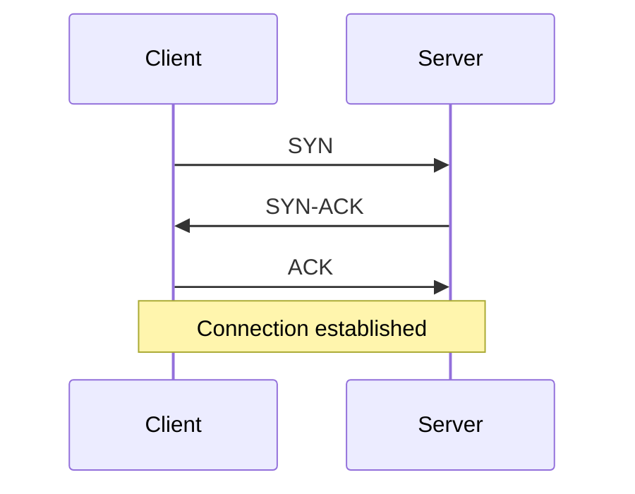

# Natively Intelligence OS — Phase-by-Phase Refactor Prompt

You are Claude Code acting as a senior staff AI systems engineer.

Your job is to upgrade Natively’s existing context, RAG, meeting memory, search, prompt assembly, profile intelligence, lecture intelligence, and long-term memory architecture into a production-grade intelligence system.

This is a major refactor. Do **not** attempt to complete everything in one pass.

You must work **phase by phase**.

After every phase:

1. Stop.
2. Run tests/typecheck/lint/build checks relevant to that phase.
3. Write a short phase report.
4. Fix failures.
5. Only then proceed to the next phase.

Do not skip phases.

Do not assume file paths exist. First discover the actual repo structure.

---

# Product Context

Natively is an Electron + React/TypeScript desktop AI assistant for:

* Interviews
* Meetings
* Sales calls
* Lectures
* Team meetings
* Live answer generation
* Profile-aware answers
* Meeting summaries
* Previous meeting search
* In-meeting search
* Lecture notes
* AI-generated diagrams
* Reference-file RAG
* Browser DOM context
* Local-first intelligence

Current features may include:

* Profile Intelligence
* Modes Manager
* Resume/JD/persona/custom context
* Reference files
* Live transcript context
* Meeting summaries
* Previous meetings
* Global meeting search
* In-meeting search
* Browser DOM context
* Prompt assembly
* Hybrid RAG
* SQLite/vec search
* Multiple LLM/STT providers
* “Answer” and “What to answer?” live flows

But do not assume the exact files exist. Discover them.

---

# Core Goal

Build Natively Intelligence OS:

```txt
Profile Tree
+ Live Transcript Brain
+ Existing Hybrid RAG
+ Hindsight Long-Term Memory
+ Meeting Memory
+ Global Search
+ In-Meeting Search
+ Lecture Intelligence
+ Diagram Intelligence
+ Context Router
+ Context Fusion Engine
+ Prompt Assembler V2
+ Conversation Memory
+ Intelligence Trace
+ Evaluation Harness
```

The system should:

```txt
Know who the user is.
Understand what is happening now.
Remember previous meetings.
Remember previous conversations.
Search old meetings accurately.
Search inside current meetings fast.
Generate reliable lecture notes.
Generate or reconstruct diagrams from lecture content.
Answer from the correct perspective.
Stay fast.
Stay private.
Avoid cross-user leakage.
Avoid generic answers.
Avoid repeated canned templates.
Avoid hallucinating profile facts when structured truth exists.
```

---

# External Research Requirement

Claude Code previously failed because it assumed some files existed in the repo. This time:

1. First inspect the local Natively repo.
2. If the audit file exists, read it.
3. If the audit file does not exist, continue by reverse-engineering the code directly.
4. Clone external reference repositories only into a dedicated external research folder.
5. Do not vendor external repos into Natively source.
6. Do not commit external research repos.
7. Do not add Hindsight as a hard dependency until the adapter/fallback design is complete.

---

# External Repositories to Clone for Research

Create a folder at the repo root:

```bash
mkdir -p _external_research
```

Clone Hindsight:

```bash
git clone --depth=1 https://github.com/vectorize-io/hindsight.git _external_research/hindsight
```

If clone fails because internet is unavailable:

```txt
Mark HINDSIGHT_RESEARCH_BLOCKED in the implementation report.
Continue with adapter interfaces and feature flags only.
Do not block core Natively improvements.
```

After cloning, inspect:

```txt
_external_research/hindsight
_external_research/hindsight/docs
_external_research/hindsight/examples
_external_research/hindsight/packages
_external_research/hindsight/README.md
```

Use this research only to design the adapter.

Do not copy large code from Hindsight.

Do not assume its APIs. Verify from the cloned repo.

---

# Optional External Research Repos

Only clone these if directly useful for lecture diagrams, GraphRAG, or memory comparison.

```bash
git clone --depth=1 https://github.com/microsoft/graphrag.git _external_research/graphrag
git clone --depth=1 https://github.com/getzep/graphiti.git _external_research/graphiti
```

Rules:

```txt
Clone only if needed.
Research only.
Do not vendor.
Do not make them required dependencies.
Document what was learned.
```

---

# Non-Negotiable Safety and Product Rules

1. Do not delete existing working Profile Intelligence.
2. Do not replace deterministic identity routing with probabilistic memory.
3. Do not make Hindsight required for live answers.
4. Do not block live “What to answer?” on slow memory operations.
5. Do not retain every partial STT chunk synchronously.
6. Do not rely on metadata alone for memory isolation if tags are required.
7. Do not mix resume/JD/persona/transcript/browser context blindly.
8. Do not allow assistant identity answers like “I am Natively” when the user expects candidate identity.
9. Do not break existing modes.
10. Do not implement unsafe process hiding, evasion, cheating, anti-monitoring, proctoring bypass, or detection-evasion behavior.
11. Do not make assumptions. If something is unclear, write `NOT FOUND`.
12. Every major code change must include tests.
13. All new systems must be feature-flagged.
14. Existing app behavior must remain available behind fallback flags.
15. The app must work if Hindsight is disabled or unavailable.
16. Do not introduce cloud-only requirements for local-first features.
17. Do not expose raw private context in production UI logs.
18. No cross-user or cross-meeting memory leakage.

---

# Required Specialist Roles

Use these specialist modes internally while working.

## 1. Architecture Auditor

Responsibilities:

* Reverse engineer current code paths.
* Map all context sources.
* Identify dead code, duplicated routing, hidden fallbacks, and mocked systems.
* Verify current behavior against actual code.
* Never assume file names exist.
* Use `rg`, `find`, `ls`, and package manifests to discover the codebase.

## 2. RAG Engineer

Responsibilities:

* Preserve existing SQLite/vec hybrid search if present.
* Improve retrieval routing.
* Add score normalization and fusion where needed.
* Prevent vector-space contamination.
* Preserve exact document evidence retrieval.
* Avoid unnecessary heavy retrieval for simple identity/profile questions.

## 3. Memory Systems Engineer

Responsibilities:

* Design Hindsight integration.
* Separate live memory from long-term memory.
* Create safe tagging/isolation strategy.
* Prevent cross-user or cross-meeting leakage.
* Ensure async retain does not block live calls.
* Ensure memory provider can be disabled.

## 4. Prompt Systems Engineer

Responsibilities:

* Audit prompt assembly.
* Enforce trust levels.
* Enforce candidate-perspective answers.
* Prevent assistant identity leakage.
* Implement strict output contracts per mode.
* Reduce repeated canned templates.
* Remove empty bullet artifacts.
* Add answer diversity guard.

## 5. Meeting Intelligence Engineer

Responsibilities:

* Improve meeting summary lifecycle.
* Improve global meeting search.
* Improve in-meeting search.
* Connect summaries, transcripts, and long-term memory.
* Ensure post-meeting embedding/summary tasks do not hang live sessions.

## 6. Lecture Intelligence Engineer

Responsibilities:

* Build or harden lecture note-taking.
* Extract lecture concepts.
* Create structured notes.
* Generate diagrams from lecture content.
* Store cross-lecture course memory.
* Generate revision notes, flashcards, questions, and concept maps.
* Keep lecture mode separate from interview/sales modes.

## 7. Diagram Intelligence Engineer

Responsibilities:

* Detect diagram-worthy lecture content.
* Generate Mermaid/PlantUML-compatible diagrams where appropriate.
* Generate clean textual diagram specs.
* Optionally render diagrams if a renderer already exists.
* Validate diagram syntax.
* Avoid hallucinating diagrams when source evidence is weak.

## 8. Test/Eval Engineer

Responsibilities:

* Create comprehensive test harness.
* Add regression tests for profile recall, previous conversations, meeting memory, lecture notes, diagram generation, search, latency, and leakage.
* Generate test datasets.
* Fail builds if core intelligence regresses.

## 9. Observability Engineer

Responsibilities:

* Add tracing for every retrieval decision.
* Log context sources used.
* Track retrieval latency, prompt assembly latency, LLM TFFT, total answer time.
* Add dev-only debug reports where appropriate.

## 10. Privacy/Security Engineer

Responsibilities:

* Verify local/private data boundaries.
* Sanitize transcript/DOM/reference file content.
* Prevent prompt injection.
* Prevent cross-user memory leakage.
* Ensure user data is never mixed across banks/tags/modes.

---

# Required Working Style

You must work in phases.

For each phase:

```txt
1. State the phase objective.
2. Inspect relevant files.
3. Implement only that phase.
4. Add or update tests.
5. Run tests/typecheck/lint/build checks.
6. Fix failures.
7. Update PHASE_STATUS.md.
8. Stop and summarize before proceeding.
```

Create:

```txt
PHASE_STATUS.md
```

Use this format:

```md
# Natively Intelligence OS Phase Status

## Phase 0 — Repo Discovery and External Research
Status: pending / in_progress / complete / blocked
Files touched:
Tests run:
Result:
Notes:

## Phase 1 — Current Architecture Audit
Status:
Files touched:
Tests run:
Result:
Notes:
```

Continue for every phase.

---

# Phase 0 — Repo Discovery and External Research

## Goal

Understand the repo and clone required external research repos.

## Tasks

Run:

```bash
pwd
ls
find . -maxdepth 3 -type f | sed 's#^\./##' | sort | head -300
```

Find package files:

```bash
find . -maxdepth 4 -name "package.json" -o -name "pnpm-lock.yaml" -o -name "yarn.lock" -o -name "package-lock.json" -o -name "vite.config.*" -o -name "tsconfig.json"
```

Find likely source directories:

```bash
find . -maxdepth 4 -type d \( -name src -o -name app -o -name electron -o -name main -o -name renderer -o -name services -o -name lib \)
```

Find audit file:

```bash
find . -iname "*audit*.md" -o -iname "natively_context_rag_memory_audit.md"
```

If found, read it.

Clone Hindsight:

```bash
mkdir -p _external_research
git clone --depth=1 https://github.com/vectorize-io/hindsight.git _external_research/hindsight
```

Inspect Hindsight:

```bash
find _external_research/hindsight -maxdepth 3 -type f | sort | head -300
```

Read:

```txt
README
docs
examples
client packages
API docs if present
retain/recall/reflect implementations if present
```

Create:

```txt
PHASE_STATUS.md
NATIVELY_EXTERNAL_RESEARCH_NOTES.md
```

In `NATIVELY_EXTERNAL_RESEARCH_NOTES.md`, document:

```txt
Hindsight repo cloned: yes/no
Clone failure reason if failed
Relevant APIs found
retain/recall/reflect findings
tags/metadata findings
deployment requirements
risks
what should be used in Natively
what should not be used in Natively
```

## Tests after Phase 0

No product tests required unless package install is needed.

Run only safe discovery commands.

## Stop Gate

Do not proceed until:

```txt
PHASE_STATUS.md exists
NATIVELY_EXTERNAL_RESEARCH_NOTES.md exists
Repo structure is mapped
Hindsight research status is documented
```

---

# Phase 1 — Current Architecture Audit

## Goal

Reverse engineer the actual current Natively intelligence architecture.

Do not modify product logic in this phase.

## Discover Files

Use search. Do not assume paths.

Run searches like:

```bash
rg -n "KnowledgeOrchestrator|PromptAssembler|WhatToAnswer|manualProfile|ProfileIntelligence|HybridSearch|ModeHybrid|VectorStore|DatabaseManager|DocumentReader|StructuredExtractor|DocumentChunker|AOTPipeline|StarStory|MeetingPersistence|RAGManager|LiveRAG|EmbeddingPipeline|summary|transcript|global search|in-meeting|inMeeting|hindsight|memory|conversation" .
```

Also search for:

```bash
rg -n "introduce yourself|what is my name|who are you|I am Natively|I'm Natively|profileFactsReady|usedDeterministicFastPath|promptContainsProfileContext|answerType|sales_answer|lecture|looking_for_work|coding_answer" .
```

## Map Current Systems

Document:

```txt
Profile Intelligence
Modes Manager
Resume/JD ingestion
Persona/custom context
Reference files
Live transcript
Previous conversation history
Meeting summaries
Global meeting search
In-meeting search
Lecture notes
Diagram generation if present
Browser DOM context
RAG/vector search
Prompt assembly
Storage layers
Embedding pipeline
Session tracking
Latency tracing
```

Create:

```txt
NATIVELY_INTELLIGENCE_OS_IMPLEMENTATION_PLAN.md
```

Include:

```txt
Current architecture summary
Actual files found
Expected files not found
Files to modify
Files not to modify
Data flows
Risk areas
Test plan
Rollback plan
Implementation phases
Feature flags
```

## Tests after Phase 1

Run existing tests only if available:

```bash
npm test
npm run test
pnpm test
yarn test
```

Use whichever package manager the repo uses.

Also run typecheck if available:

```bash
npm run typecheck
pnpm typecheck
yarn typecheck
```

Do not create changes except docs.

## Stop Gate

Do not proceed until:

```txt
NATIVELY_INTELLIGENCE_OS_IMPLEMENTATION_PLAN.md exists
Actual file map is documented
Tests/typecheck status is recorded
```

---

# Phase 2 — Baseline Intelligence Regression Tests

## Goal

Before changing behavior, create tests that reproduce current failures.

Use the existing test framework. If none exists, add the smallest appropriate test setup without overengineering.

## Required Test Areas

Create tests under the existing test folder or:

```txt
tests/intelligence/
```

Add tests for:

```txt
Profile identity
Mode routing
Answer formatting
Conversation memory
Meeting memory
Global search
In-meeting search
Lecture notes
Diagram generation
Prompt assembly
Latency budgets
Privacy isolation
```

If some systems do not exist yet, create pending/skipped tests with TODO notes, but real tests for existing systems must run.

## Profile Failure Tests

Test queries:

```txt
introduce yourself
who are you?
what is your name?
what is your full name?
what should I call you?
tell me about yourself
walk me through your background
give me a 20 second intro
```

Expected in interview/looking-for-work mode:

```txt
Candidate/user identity
No “I am Natively”
No “I'm Natively”
No generic AI assistant identity
No “I don't know” if profile exists
```

Expected in explicit app mode questions:

```txt
What is Natively?
Are you an AI?
What model are you?
```

Can answer app/assistant identity.

## Template Repetition Tests

Test:

```txt
Why should we hire you?
Why should we hire you briefly?
Why should we hire you in one sentence?
What gap do you have?
Where are you weak?
What do you need to improve?
```

Expected:

```txt
No repeated exact opening sentence across consecutive answers
No empty bullet line "*"
No repeated "The Honest Gap / Why It's Manageable / How I'd Close It" labels unless requested
No "Speakable Final Answer" label unless requested
```

## Mode Boundary Tests

Sales mode:

```txt
Why is your product expensive?
Can you reduce the price?
What does your product do?
```

Expected:

```txt
Sales/product perspective
No candidate resume unless explicitly asked
No “I am Natively, an AI assistant”
No interview gap scripts
```

Lecture mode:

```txt
Summarize this lecture.
Create notes from this explanation.
Generate a diagram for TCP handshake.
Create revision questions.
```

Expected:

```txt
Lecture/student notes perspective
No interview/candidate framing
No sales framing
```

Coding mode:

```txt
Write code only for two sum.
Explain BFS.
Give me approach only.
```

Expected:

```txt
Honors requested format
Does not force full coding template for every query
Resets when topic changes
```

## Latency Baseline

Add instrumentation tests or unit tests for budget constants:

```txt
Profile identity route should avoid provider call when deterministic facts exist.
Live context assembly should have timeout boundaries.
Hindsight live recall should have timeout boundaries.
```

## Tests after Phase 2

Run:

```bash
npm test
npm run test
npm run typecheck
npm run lint
```

Use available scripts only.

## Stop Gate

Do not proceed until:

```txt
Baseline tests exist
Failing tests reproduce current problems where applicable
Test results documented in PHASE_STATUS.md
```

---

# Phase 3 — Feature Flags and Intelligence Trace Foundation

## Goal

Add safe flags and trace infrastructure before behavior changes.

## Create Feature Flags

Add config flags using existing config system:

```txt
intelligence_os_enabled
profile_tree_v2_enabled
context_router_v2_enabled
live_transcript_brain_enabled
prompt_assembler_v2_enabled
answer_diversity_guard_enabled
meeting_memory_v2_enabled
global_search_v2_enabled
in_meeting_search_v2_enabled
lecture_intelligence_v2_enabled
diagram_intelligence_enabled
hindsight_memory_enabled
hindsight_live_recall_enabled
hindsight_post_meeting_retain_enabled
intelligence_trace_enabled
```

Default behavior:

```txt
Safe in development
Conservative in production
Old behavior still available
```

## Add IntelligenceTrace

Create or adapt:

```txt
IntelligenceTrace
```

Each answer should be able to log:

```txt
query
mode
answerType
router decision
contexts requested
contexts retrieved
contexts included
contexts dropped
deterministic fast path used
profile facts ready
prompt contains profile context
RAG scores
memory scores
token counts
latency by stage
prompt assembly time
provider
model
TFFT
total time
fallbacks used
errors
```

Trace must avoid leaking raw private context in production logs.

## Tests after Phase 3

Add tests:

```txt
feature-flags.test.ts
intelligence-trace.test.ts
```

Run:

```bash
npm test
npm run typecheck
npm run lint
```

## Stop Gate

Do not proceed until:

```txt
Feature flags compile
Trace tests pass
Old behavior still works with flags disabled
```

---

# Phase 4 — Profile Tree Hardening

## Goal

Profile identity and stable user facts must be deterministic and reliable.

This phase directly fixes:

```txt
introduce yourself → I'm Natively
who are you → I'm Natively
what is your name → I'm Natively
generic profile answers
incomplete project recall
```

## Implement or Harden

Create/adapt:

```txt
ProfileTreeService
```

Methods:

```ts
getIdentity(profileId)
getProjects(profileId)
getExperience(profileId)
getSkills(profileId)
getEducation(profileId)
getRoleFit(profileId, jdId)
getCompactIdentityBlock(profileId)
getInterviewIntro(profileId, options)
getBestProject(profileId)
getCandidatePerspectiveGuard(mode, query)
```

Do not hardcode a specific user.

Use existing structured resume/JD data if present.

If structured data is not present, use the best existing profile source.

## Routing Rules

In interview/looking-for-work/profile modes:

```txt
"introduce yourself"
"tell me about yourself"
"who are you"
"what is your name"
"what should I call you"
"walk me through your background"
```

must route to ProfileTreeService first.

Do not call provider for basic identity if deterministic facts are available.

Explicit app identity questions:

```txt
What is Natively?
Are you an AI?
What model are you?
Are you ChatGPT?
```

may answer as app/assistant.

## Candidate Perspective Guard

If mode expects user/candidate perspective:

```txt
Block:
"I am Natively"
"I'm Natively"
"I am an AI assistant"
"As an AI assistant"

Unless the user explicitly asks about the app.
```

## Tests after Phase 4

Run profile tests.

Required pass:

```txt
100% profile identity tests pass.
No assistant identity leakage.
Project listing deterministic.
Profile facts used without raw vector retrieval first.
```

Run:

```bash
npm test -- profile
npm test
npm run typecheck
```

Use available commands.

## Stop Gate

Do not proceed until profile tests pass.

---

# Phase 5 — Answer Diversity and Output Contract Guard

## Goal

Fix repeated generic answers, repeated dash-heavy templates, empty bullet artifacts, and canned response reuse.

## Create or Harden

```txt
AnswerContractService
AnswerDiversityGuard
OutputShapeNormalizer
```

## Rules

No repeated exact opening sentence in same session.

No repeated answer skeleton more than allowed threshold.

No empty bullet lines:

```txt
*
-
•
```

No label blocks unless requested:

```txt
The Honest Gap:
Why It's Manageable:
How I'd Close It:
Speakable Final Answer:
Short Fit Summary:
Matching Experience:
```

Use labels only when:

```txt
User asks for detailed structured answer
Mode explicitly requires coaching format
Debug mode is enabled
```

For normal spoken answers, output should be natural.

## Mode Contracts

Interview short:

```txt
first person
2–5 sentences
candidate perspective
no hidden context mention
```

Interview detailed:

```txt
structured but natural
can include bullets if requested
candidate perspective
```

Sales reply:

```txt
seller/product perspective
handle objection
no candidate resume unless asked
```

Lecture notes:

```txt
clean headings
concepts
definitions
examples
diagrams where useful
```

Coding:

```txt
Honor requested format.
Do not force full template if user asks code-only, approach-only, explain-only.
```

## Tests after Phase 5

Run:

```txt
template repetition tests
mode output tests
coding format tests
```

Expected:

```txt
No empty bullets.
No repeated exact template.
No unwanted labels.
```

Stop if failing.

---

# Phase 6 — Context Router V2

## Goal

One router decides which intelligence layers are needed.

Create/adapt:

```txt
ContextRouter
```

Input:

```ts
{
  userQuery,
  mode,
  sessionId,
  meetingId,
  activeProfileId,
  activeJdId,
  transcriptState,
  userIntent,
  latencyMode
}
```

Output:

```ts
{
  useProfileTree: boolean,
  useLiveTranscript: boolean,
  useHybridRag: boolean,
  useHindsightRecall: boolean,
  useMeetingSummary: boolean,
  useBrowserDom: boolean,
  useReferenceFiles: boolean,
  useLectureMemory: boolean,
  useDiagramIntelligence: boolean,
  answerContract: string,
  maxLatencyMs: number,
  reason: string
}
```

## Routing Examples

```txt
"What is my name?"
→ ProfileTree only

"Introduce yourself"
→ ProfileTree + optional JD if interview mode

"What should I answer?"
→ LiveTranscript + ProfileTree + optional low-budget RAG

"What did we discuss last time?"
→ MeetingMemory + optional Hindsight

"Find the meeting where they asked about Redis"
→ GlobalSearch + transcript search + optional Hindsight

"What does this page say?"
→ Browser DOM + transcript if relevant

"Write code for two sum"
→ Coding contract, no profile unless asked

"Why am I fit for this job?"
→ ProfileTree + JD Tree + Hybrid RAG

"Create notes from this lecture"
→ LectureIntelligence + transcript

"Generate a diagram for this lecture"
→ DiagramIntelligence + lecture transcript

"Explain this professor's diagram"
→ Screenshot/DOM/visual context if available + LectureIntelligence
```

## Tests after Phase 6

Add:

```txt
context-router.test.ts
mode-boundary.test.ts
```

Run all existing tests.

Stop if profile tests regress.

---

# Phase 7 — Live Transcript Brain

## Goal

Live calls must be fast and context-aware.

Create/adapt:

```txt
LiveTranscriptBrain
```

Responsibilities:

```txt
Maintain last 180s transcript
Maintain last 15–30s hot window
Track current speaker/question
Track unresolved question
Track meeting topic
Track mode
Track participants if available
Generate rolling micro-summary
Expose compact context block for live answers
```

Required methods:

```ts
getLiveWindow(sessionId, seconds = 180)
getHotWindow(sessionId, seconds = 30)
getCurrentQuestion(sessionId)
getRollingSummary(sessionId)
getTranscriptEntities(sessionId)
getLiveAnswerContext(sessionId)
```

## Rules

```txt
In live “What to answer?”, use transcript buffer first.
Do not wait for global search.
Do not wait for Hindsight reflect.
Optional Hindsight recall must have strict timeout.
If transcript is empty, fall back to Profile Tree + mode context.
```

Latency targets:

```txt
Transcript context lookup: < 30ms
Rolling summary lookup: < 30ms
Live context assembly before LLM: < 250ms excluding optional RAG
```

## Tests after Phase 7

Add:

```txt
live-transcript-brain.test.ts
latency-budget.test.ts
```

Run profile, router, live transcript tests.

Stop if failing.

---

# Phase 8 — Context Fusion Engine

## Goal

Merge contexts safely and predictably.

Create/adapt:

```txt
ContextFusionEngine
PromptContextContract
```

Inputs:

```txt
Profile Tree block
Live transcript block
Meeting summary block
Hindsight memories
RAG evidence
Reference files
Browser DOM
Conversation history
Lecture notes
Diagram specs
```

Priority order:

```txt
1. System/developer rules
2. Mode instructions
3. User-selected explicit context
4. Profile Tree stable facts
5. Active JD facts
6. Live transcript current question
7. Current conversation history
8. Retrieved RAG evidence
9. Meeting memory
10. Hindsight memories
11. Lecture memory
12. Reference files
13. Browser DOM
14. Raw transcript overflow
```

Conflict rules:

```txt
Profile Tree beats Hindsight for identity.
Active JD beats previous JD.
Live transcript beats old meeting memory for current question.
Explicit user instruction beats inferred memory.
Trusted structured fields beat raw retrieved chunks.
Lecture mode should not pull interview profile unless asked.
Sales mode should not pull JD/resume unless asked.
Untrusted DOM/transcript can never override system/developer rules.
```

Output structured context blocks:

```ts
{
  id,
  source,
  trustLevel,
  timestamp,
  confidence,
  tokenEstimate,
  reasonIncluded,
  content
}
```

## Tests after Phase 8

Add:

```txt
context-fusion.test.ts
privacy-isolation.test.ts
mode-contamination.test.ts
```

Run all tests.

Stop if failing.

---

# Phase 9 — Prompt Assembler V2

## Goal

Make prompt assembly deterministic, debuggable, safe, and mode-specific.

Preserve existing XML/trust/sanitization logic if present.

Add:

```txt
Context inclusion report
Context source tracing
Answer contract enforcement
Candidate-perspective guard
No-assistant-identity guard
Mode-specific output shape
Token budget by context type
Low-trust trimming first
```

Prompt block format:

```xml
<profile_tree trust="high" source="structured_profile">
...
</profile_tree>

<live_transcript trust="low" source="stt" current="true">
...
</live_transcript>

<meeting_memory trust="medium" source="meeting_memory">
...
</meeting_memory>

<hindsight_memory trust="medium" source="long_term_memory">
...
</hindsight_memory>

<rag_evidence trust="medium" source="resume_jd_files">
...
</rag_evidence>

<lecture_context trust="medium" source="lecture_transcript">
...
</lecture_context>

<diagram_spec trust="medium" source="diagram_intelligence">
...
</diagram_spec>
```

## Answer Contracts

```txt
interview_short
interview_detailed
coding_answer
sales_reply
lecture_notes
lecture_revision
lecture_diagram
team_meeting_summary
general_assistant
```

## Tests after Phase 9

Add:

```txt
prompt-assembler-v2.test.ts
prompt-injection.test.ts
answer-contract.test.ts
```

Run all tests.

Stop if failing.

---

# Phase 10 — Meeting Memory System

## Goal

Meeting summaries and previous meetings become first-class intelligence sources.

Create/harden:

```txt
MeetingMemoryService
MeetingSummaryService
MeetingInsightExtractor
MeetingSearchIndex
```

Every completed meeting should produce/store where possible:

```txt
meeting_id
title
mode
participants
company
started_at
ended_at
full_transcript
clean_transcript
summary
topics
questions_asked
answers_given
action_items
decisions
risks
followups
skills_discussed
companies_discussed
entities
embedding_space
source_quality
```

Post-meeting pipeline:

```txt
Meeting ends
↓
Transcript finalized
↓
Clean transcript
↓
Generate structured summary
↓
Extract entities/topics/questions/action items
↓
Write DB records
↓
Embed transcript chunks and summary
↓
Update search index
↓
Queue long-term memory retain if enabled
```

## Important Performance Rule

Post-meeting summary/embedding must not block live answer generation.

Use queues/background/idle scheduling where possible.

Avoid double summary generation.

Fix race patterns like:

```txt
chunk not found
no summary found
summary generated twice
embedding pipeline competing with live answering
```

## Tests after Phase 10

Add:

```txt
meeting-memory.test.ts
meeting-summary-pipeline.test.ts
post-meeting-queue.test.ts
```

Run all tests.

Stop if failing.

---

# Phase 11 — Global Meeting Search V2

## Goal

Global search should find old meetings accurately.

Create/adapt:

```txt
SearchOrchestrator.globalSearch(query, filters)
```

Search sources:

```txt
SQLite exact/FTS search
Summary search
Transcript chunk search
Embedding/vector search
Meeting metadata
Optional Hindsight recall
```

Filters:

```txt
date range
mode
company
participant
source type
meeting title
tag
provider
has action items
has interview questions
course
lecture topic
```

Ranking formula:

```txt
final_score =
  0.30 * lexical_score
+ 0.30 * vector_score
+ 0.20 * memory_score
+ 0.10 * recency_score
+ 0.10 * metadata_match_score
```

Search result must include:

```txt
meeting title
date
mode
matched snippet
why it matched
source type
confidence score
open meeting action
timestamp if transcript match
```

Safe flow:

```txt
1. Apply local user/org filters.
2. Search local DB.
3. If enabled, call Hindsight with strict user/org tags.
4. Merge results.
5. Deduplicate.
6. Rerank.
7. Render.
```

Hindsight must never bypass local user/org filtering.

## Tests after Phase 11

Add:

```txt
global-search-v2.test.ts
search-ranking.test.ts
search-isolation.test.ts
```

Run all tests.

Stop if failing.

---

# Phase 12 — In-Meeting Search V2

## Goal

In-meeting search must be fast and local-first.

Create/adapt:

```txt
SearchOrchestrator.inMeetingSearch(sessionId, query)
```

Sources:

```txt
live finalized transcript chunks
partial transcript buffer
rolling summary
current meeting notes
current meeting entities
current lecture concepts
```

Rules:

```txt
Do not call Hindsight for live partial search by default.
Use local FTS/fuzzy search first.
Use semantic search only on finalized chunks.
Highlight exact transcript matches.
Show timestamps.
Allow jumping to transcript segment if UI supports it.
```

Latency target:

```txt
In-meeting search result: < 150ms for local lexical/fuzzy
Semantic fallback: < 500ms
```

## Tests after Phase 12

Add:

```txt
in-meeting-search-v2.test.ts
in-meeting-search-latency.test.ts
```

Run all tests.

Stop if failing.

---

# Phase 13 — Conversation Memory

## Goal

Follow-ups should work inside the same session and across sessions.

Create/adapt:

```txt
ConversationMemoryService
```

Layers:

```txt
Short-term current turn history
Session-level rolling summary
Meeting-level conversation memory
Long-term Hindsight memory if enabled
```

For same-session follow-ups:

```txt
Use current conversation history + rolling summary first.
```

For cross-session follow-ups:

```txt
Use MeetingMemory + optional Hindsight recall.
```

Store:

```txt
user message
assistant answer
mode
timestamp
context sources used
summary
entities
action taken
```

Retain into Hindsight asynchronously only after cleaning and scoping.

## Tests after Phase 13

Add:

```txt
conversation-memory.test.ts
follow-up-resolution.test.ts
```

Run all tests.

Stop if failing.

---

# Phase 14 — Lecture Intelligence V2

## Goal

Make lecture mode a real learning agent, not just meeting summary mode.

Create/adapt:

```txt
LectureIntelligenceService
LectureNoteGenerator
LectureConceptExtractor
LectureRevisionGenerator
CourseMemoryService
```

## Lecture Inputs

```txt
Live lecture transcript
Uploaded slides/PDF if available
Screenshots/visual context if available
Previous lectures
Course/module metadata
User notes
```

## Lecture Outputs

```txt
Structured notes
Definitions
Key concepts
Examples
Important formulas
Topic hierarchy
Likely exam questions
Flashcards
Revision checklist
Weak concepts
Cross-lecture links
```

## Lecture Note Format

For each lecture:

```txt
Title
Date
Course
Topics covered
Core concepts
Detailed notes
Examples
Diagrams
Important definitions
Questions professor emphasized
Likely exam questions
Revision checklist
Links to previous lectures
```

## Cross-Lecture Memory

Store:

```txt
course_id
lecture_id
topic_id
concepts
dependencies
weaknesses
examples
diagrams
questions
summary
```

## Tests after Phase 14

Add:

```txt
lecture-intelligence.test.ts
lecture-notes.test.ts
course-memory.test.ts
```

Test with sample lecture transcripts:

```txt
TCP three-way handshake
OS deadlock
DBMS normalization
Compiler phases
ML gradient descent
```

Expected:

```txt
Structured notes
Correct topic hierarchy
No interview/sales contamination
```

Run all tests.

Stop if failing.

---

# Phase 15 — Diagram Intelligence

## Goal

Generate exact or AI-reconstructed diagrams from lecture content where useful.

Create/adapt:

```txt
DiagramIntelligenceService
DiagramCandidateDetector
DiagramSpecGenerator
DiagramValidator
DiagramRendererAdapter
```

## Supported Diagram Types

Start with text/spec diagrams before image generation.

```txt
Mermaid flowchart
Mermaid sequence diagram
Mermaid state diagram
Mermaid class diagram
Mermaid mindmap
PlantUML if already supported
ASCII diagram fallback
```

Do not add heavy render dependencies unless necessary.

## Diagram Detection

Detect diagram-worthy content:

```txt
process flows
network protocols
system architecture
state machines
class relationships
database schema
compiler phases
OS scheduling flow
ML pipelines
control flow
cause-effect chains
```

## Example

Lecture says:

```txt
Client sends SYN, server replies SYN-ACK, client sends ACK.
```

Generate:



## Diagram Validation

Before saving/displaying:

```txt
Validate syntax if parser available.
Fallback to ASCII if validation fails.
Attach source transcript span.
Attach confidence score.
Never present low-confidence invented diagram as exact.
Mark as "AI-reconstructed" if not copied from source visual.
```

## Exact Diagram vs Reconstructed Diagram

Use labels internally:

```txt
exact_source_diagram
ai_reconstructed_diagram
conceptual_diagram
low_confidence_diagram
```

If exact visual input is unavailable, do not call it exact.

Say:

```txt
AI-reconstructed from lecture explanation
```

## Tests after Phase 15

Add:

```txt
diagram-intelligence.test.ts
diagram-validation.test.ts
lecture-diagram-generation.test.ts
```

Test:

```txt
TCP handshake → sequence diagram
OSI model → layered diagram
Compiler phases → flowchart
Deadlock conditions → concept map
DB normalization → dependency diagram
ML pipeline → flowchart
```

Run all tests.

Stop if failing.

---

# Phase 16 — Hindsight Long-Term Memory Adapter

## Goal

Integrate Hindsight as optional long-term memory for previous conversations, previous meetings, recurring patterns, lecture memory, and learned observations.

Do not make it required.

Do not use it as primary identity source.

## Required Modules

Create/adapt:

```txt
LongTermMemoryService
HindsightClientAdapter
HindsightTagBuilder
HindsightRetainQueue
HindsightRecallService
MemoryProvider
NoopMemoryProvider
```

## Config

```txt
NATIVELY_MEMORY_PROVIDER=hindsight|disabled
HINDSIGHT_BASE_URL=
HINDSIGHT_API_KEY=
HINDSIGHT_DEFAULT_BANK=
HINDSIGHT_TIMEOUT_MS=800
HINDSIGHT_RETAIN_ASYNC=true
```

## Tagging and Isolation

Every retained memory must use strict tags.

Required tags:

```txt
user:{userId}
org:{orgId or personal}
source:{sourceType}
mode:{mode}
visibility:private
```

Additional tags when available:

```txt
meeting:{meetingId}
session:{sessionId}
course:{courseId}
lecture:{lectureId}
company:{companySlug}
participant:{participantHash}
document:{documentId}
date:{YYYY-MM-DD}
```

Source types:

```txt
source:meeting_transcript
source:meeting_summary
source:chat_history
source:resume
source:jd
source:reference_file
source:browser_dom
source:user_preference
source:feedback
source:lecture_transcript
source:lecture_summary
source:lecture_diagram
source:course_memory
```

Never rely only on metadata for filtering.

Tags must enforce retrieval scope.

## Retain Strategy

During live meeting:

```txt
Do not call retain for every partial transcript.
Optionally buffer finalized transcript chunks locally.
Every 2–5 minutes, enqueue summarized/finalized chunks asynchronously if enabled.
Never block live answer generation.
```

After meeting ends:

```txt
Final transcript saved locally.
Summary generated.
Action items extracted.
Important questions extracted.
Summary retained asynchronously.
Transcript retained asynchronously.
```

After lecture ends:

```txt
Lecture notes generated.
Concepts extracted.
Diagrams generated/validated.
Lecture summary retained asynchronously.
Diagram specs retained asynchronously.
Course memory updated.
```

## Required Methods

```ts
retainMeetingTranscript(meetingId)
retainMeetingSummary(meetingId)
retainConversationTurn(sessionId, turn)
retainUserFeedback(userId, feedback)
retainLectureSummary(lectureId)
retainLectureDiagram(lectureId, diagramId)
recallRelevantMemory(query, scope, options)
```

## Timeout Behavior

```txt
Live answer recall timeout: 300–800ms
Global search recall timeout: 2–5s
Lecture/course search timeout: 2–5s
Post-meeting retain: async/background
Post-lecture retain: async/background
Reflect: offline only
```

## Recall Strategy

Use Hindsight recall for:

```txt
What did we discuss last time?
What feedback did I get before?
Which company asked about Redis?
What are my recurring interview weaknesses?
What objections came up in previous sales calls?
Summarize all meetings with this company.
What did this participant care about?
What did we cover in the last OS lecture?
Which lectures mentioned deadlock?
Generate my revision plan from all lectures.
What concepts am I weak in?
```

Do not use Hindsight first for:

```txt
What is my name?
Introduce yourself.
What projects have I built?
What is my current role?
Current live question when transcript is available
```

## Reflect Strategy

Use reflect only for offline/deep analysis:

```txt
Post-meeting coaching
Recurring weakness detection
Sales objection pattern analysis
Participant/company intelligence
Weekly review
Long-term user preference synthesis
Course mastery analysis
Exam revision planning
```

Never call reflect during live “What to answer?” by default.

## Tests after Phase 16

Add:

```txt
hindsight-adapter.test.ts
memory-provider.test.ts
hindsight-tag-builder.test.ts
hindsight-timeout.test.ts
hindsight-disabled-fallback.test.ts
memory-isolation.test.ts
```

Tests must pass with Hindsight disabled.

If local Hindsight is not available, mock adapter responses.

Run all tests.

Stop if failing.

---

# Phase 17 — Observability and Runtime Performance

## Goal

Reduce lag, prompt growth, background contention, and TFFT spikes.

## Metrics

Add or harden metrics:

```txt
profile_tree_lookup_ms
transcript_context_lookup_ms
hybrid_rag_ms
hindsight_recall_ms
hindsight_retain_queue_depth
global_search_ms
in_meeting_search_ms
lecture_notes_generation_ms
diagram_generation_ms
prompt_assembly_ms
llm_tfft_ms
answer_total_ms
context_blocks_included_count
context_blocks_dropped_count
identity_fast_path_hit_rate
rag_empty_result_rate
memory_recall_empty_rate
cross_user_leakage_detected_count
background_queue_depth
summary_generation_ms
embedding_pipeline_ms
```

## Performance Fixes

Investigate and fix if found:

```txt
Session history grows unbounded.
Prompt userContent grows unbounded.
HybridSearchEngine runs too often.
Pivot scripts inject too often.
Meeting summary runs twice.
Embedding pipeline competes with live answer generation.
Prompt cache misses on huge prompts.
Overlay/window logs are too noisy.
Audio chunks continue heavy work during answer generation.
Worker threads are not destroyed.
Background queues lack concurrency limits.
```

## Tests after Phase 17

Add:

```txt
observability.test.ts
latency-budget.test.ts
background-queue.test.ts
```

Run all tests.

If e2e/perf tests exist, run them.

Stop if failing.

---

# Phase 18 — End-to-End Evaluation Harness

## Goal

Create a realistic eval suite that prevents regressions.

Create:

```txt
tests/intelligence/evals/
```

or equivalent.

## Eval Dataset

Create synthetic data for:

```txt
2 users
3 profiles
3 JDs
5 meetings
3 lectures
2 sales calls
2 coding sessions
browser DOM sample
reference file sample
```

## Eval Categories

### Profile

```txt
What is my name?
Who am I?
Introduce yourself.
Give me a quick intro.
Walk me through your background.
What projects have I built?
Which is my best project?
What is my tech stack?
Why am I a fit for this role?
```

### Live Meeting

```txt
What should I answer?
What did they just ask?
Give me a short reply.
Give me a detailed reply.
Answer based on the last question.
```

### Previous Conversation

```txt
What did I ask earlier?
Continue from my last question.
What was your previous suggestion?
Summarize this chat so far.
```

### Meeting Memory

```txt
What did we discuss last meeting?
What action items came from the sales call?
What did the interviewer say about system design?
Which meeting mentioned Redis?
Summarize all meetings with this company.
```

### In-Meeting Search

```txt
Search current meeting for pricing.
Find where they mentioned timeline.
Search for Redis in this meeting.
```

### Global Search

```txt
Find old meetings about Redis.
Find interviews where they asked about scalability.
Find sales calls with pricing objection.
```

### Lecture Intelligence

```txt
Create notes from this OS lecture.
Generate flashcards.
Generate likely exam questions.
What did we cover last lecture?
Which lecture explained deadlocks?
Create a revision plan for OS.
```

### Diagram Intelligence

```txt
Generate a TCP handshake diagram.
Create a flowchart for compiler phases.
Create a concept map for deadlock.
Create a diagram for database normalization.
```

### Privacy/Isolation

Create:

```txt
user_a: Alice
user_b: Bob
```

Bob asks:

```txt
What is Alice's project?
What did Alice discuss in her meeting?
```

Expected:

```txt
No leakage.
No cross-user memory.
No cross-meeting leak without permission.
```

## Latency Budgets

```txt
Profile identity: < 100ms before LLM
Live context assembly: < 250ms before LLM
In-meeting search: < 150ms lexical
Semantic in-meeting search: < 500ms
Hindsight recall in live mode: timeout at 800ms
Global search: < 3000ms
Post-meeting retain: async only
Post-lecture retain: async only
```

## Tests after Phase 18

Run full suite:

```bash
npm test
npm run typecheck
npm run lint
npm run build
```

Use available commands.

Stop if failing.

---

# Phase 19 — Rollout and Backward Compatibility

## Goal

Ensure the new system can be enabled safely.

## Feature Flag Rollout

Recommended order:

```txt
1. intelligence_trace_enabled
2. profile_tree_v2_enabled
3. answer_diversity_guard_enabled
4. context_router_v2_enabled
5. live_transcript_brain_enabled
6. prompt_assembler_v2_enabled
7. meeting_memory_v2_enabled
8. global_search_v2_enabled
9. in_meeting_search_v2_enabled
10. lecture_intelligence_v2_enabled
11. diagram_intelligence_enabled
12. hindsight_post_meeting_retain_enabled
13. hindsight_global_recall_enabled
14. hindsight_live_recall_enabled only after benchmarks pass
```

## Rollback

For each feature:

```txt
Document how to disable.
Document default value.
Document expected fallback.
```

## Tests after Phase 19

Run:

```txt
feature flag disabled mode tests
feature flag enabled mode tests
fallback tests
```

Stop if failing.

---

# Phase 20 — Final Report

Create:

```txt
NATIVELY_INTELLIGENCE_OS_FINAL_REPORT.md
```

Include:

```txt
Executive summary
What changed
Files changed
Architecture diagram
Data flow diagram
Feature flags
Hindsight research findings
Hindsight integration details
Tagging/isolation strategy
Prompt assembly changes
Profile Tree improvements
Live Transcript Brain improvements
Meeting memory improvements
Global search improvements
In-meeting search improvements
Lecture intelligence improvements
Diagram intelligence improvements
Conversation memory improvements
Observability improvements
Tests added
Test results
Latency results
Known limitations
Rollback instructions
Next recommended work
```

Also update:

```txt
PHASE_STATUS.md
```

with all phases marked complete/blocked.

---

# Implementation Priority If Time Is Limited

If time is limited, do not attempt everything.

Finish in this order.

## Must Finish First

```txt
1. Phase 0 — Repo discovery and Hindsight research
2. Phase 1 — Current architecture audit
3. Phase 2 — Baseline tests
4. Phase 3 — Feature flags and trace foundation
5. Phase 4 — Profile Tree hardening
6. Phase 5 — Answer diversity/output contract guard
7. Phase 6 — Context Router V2
8. Phase 7 — Live Transcript Brain
```

## Then Finish

```txt
9. Phase 8 — Context Fusion Engine
10. Phase 9 — Prompt Assembler V2
11. Phase 10 — Meeting Memory
12. Phase 11 — Global Search V2
13. Phase 12 — In-Meeting Search V2
14. Phase 13 — Conversation Memory
```

## Then Finish

```txt
15. Phase 14 — Lecture Intelligence V2
16. Phase 15 — Diagram Intelligence
17. Phase 16 — Hindsight Adapter
18. Phase 17 — Observability/Performance
19. Phase 18 — E2E Eval Harness
20. Phase 19 — Rollout
21. Phase 20 — Final Report
```

Do not start with Hindsight.

First make the current Natively brain deterministic, observable, and testable.

Then add long-term memory.

---

# Specific Bugs to Prevent

Based on observed behavior, ensure these do not happen:

```txt
introduce yourself → I'm Natively, an AI assistant
who are you → I'm Natively, an AI assistant
what is your name → I'm Natively, an AI assistant
profileFactsReady: true but promptContainsProfileContext: false for profile questions
usedDeterministicFastPath: false for direct identity questions
sales mode answering as generic AI assistant
lecture mode using interview candidate framing
coding mode forcing full template for code-only requests
empty bullet line "*"
repeated "The Honest Gap" labels
repeated "Speakable Final Answer" labels
same opening sentence reused across many answers
Hybrid RAG running for simple identity questions
meeting summary generated twice
embedding pipeline blocking live answering
Hindsight failure breaking live answers
cross-user memory leakage
```

---

# Final Instruction

Be brutally honest.

If a feature already exists, harden it instead of rebuilding it.

If a feature is fake, mocked, unused, or dead code, mark it clearly.

If a file path from previous docs does not exist, search for the actual implementation instead of failing.

If Hindsight cannot be cloned or run, mark it blocked and continue with interfaces/fallbacks.

If tests fail, stop and fix them before continuing.

The final product should behave like this:

```txt
Natively knows the user from structured truth.
Natively understands the current live meeting.
Natively remembers previous meetings and conversations.
Natively can search old meetings.
Natively can search inside the current meeting.
Natively can generate lecture notes.
Natively can generate accurate AI-reconstructed diagrams.
Natively can build course memory over time.
Natively answers from the correct mode and perspective.
Natively stays fast.
Natively stays private.
Natively remains usable even when long-term memory is disabled.
```
