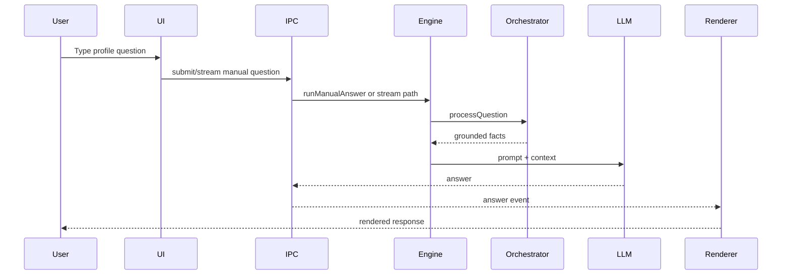
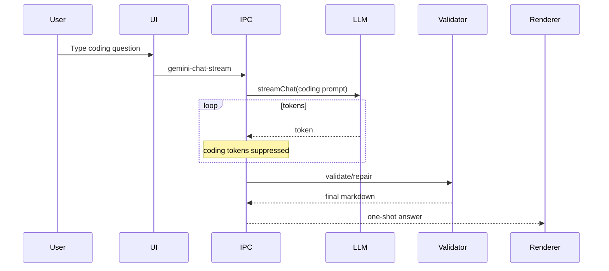
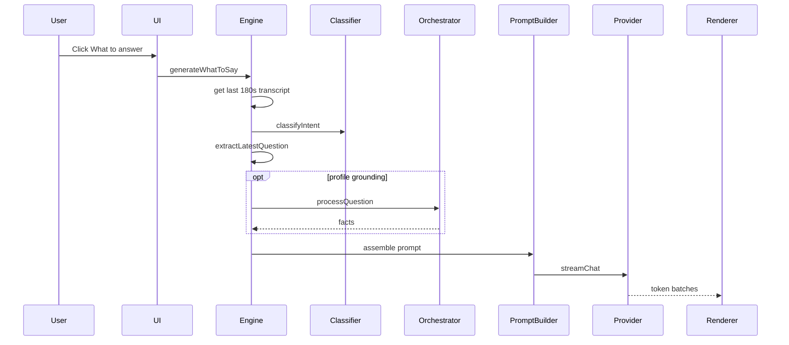
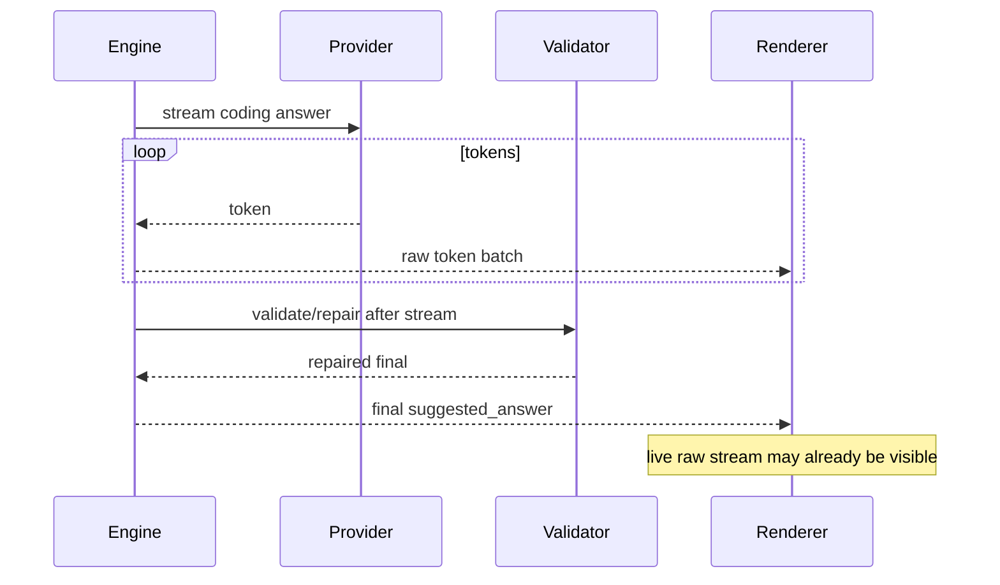
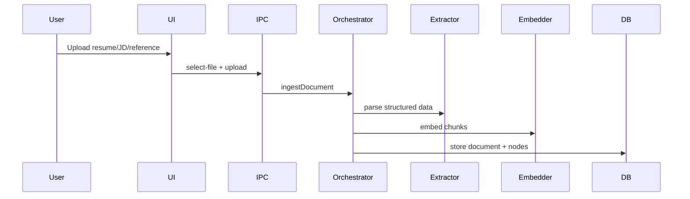
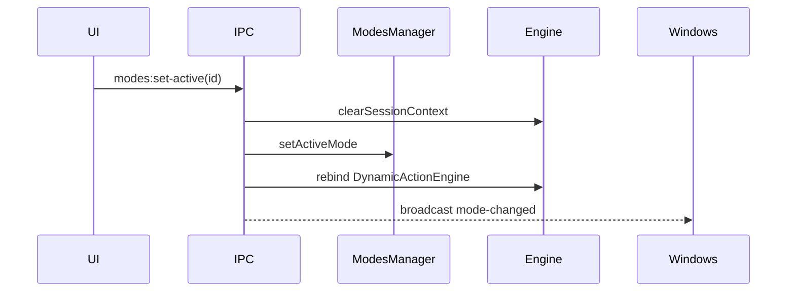
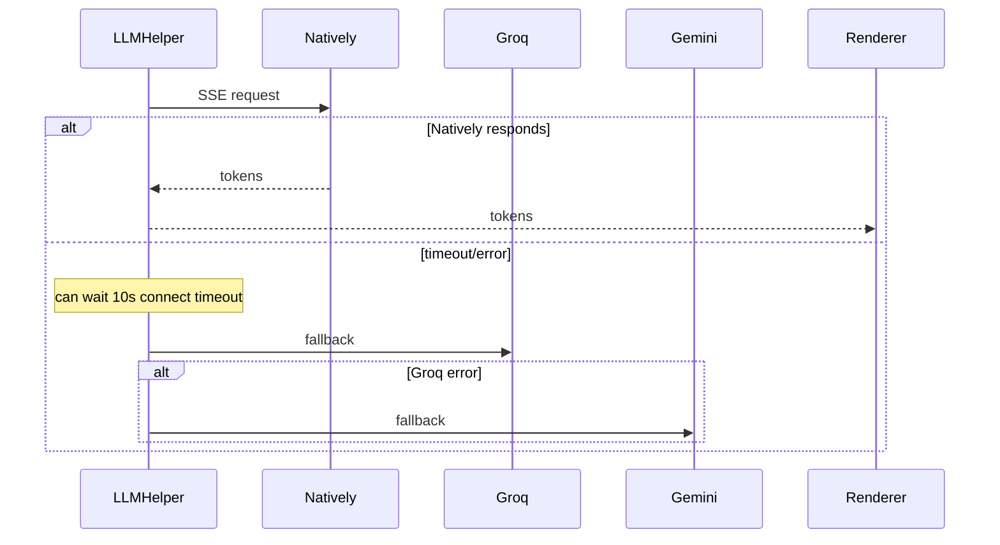

# REPORT_TO_CHATGPT: Natively Profile Intelligence Deep Technical Map

> Evidence-based map of Natively's Profile Intelligence system, assembled from read-only investigation of `/Users/evin/natively-cluely-ai-assistant` (branch `fix/overlay-startup-slide`, commit `8dcbb4f`). Major claims cite file/function evidence. Where exact line numbers are from agent inspection, they are included; where not re-verified in this final synthesis, the report says so.

## 1. Executive Summary

Natively's Profile Intelligence is a real-time interview/meeting copilot. It uses uploaded resume/JD/profile data, live transcript, screen context, modes, persona, negotiation context, and provider LLMs to answer either manually typed questions or the overlay's **What to answer?** action.

The system is powerful but currently fails in four major ways:

1. **Latency can hit ~10 seconds.** The live path can do multiple sequential pre-stream steps before any answer token appears: intent classification, latest-question extraction, optional profile grounding via `KnowledgeOrchestrator.processQuestion`, answer planning, mode/reference hybrid retrieval, prompt assembly, and provider streaming. The strongest concrete latency suspect is the exact `10_000`ms Natively API connect timeout in `electron/LLMHelper.ts` (`streamWithNatively`), followed by serial Natively→Groq→Gemini fallback.
2. **Answers are non-deterministic.** Providers use non-zero and inconsistent temperature settings, no seed, provider-specific system prompts, serial fallback to different models, and free-form markdown generation instead of a structured answer object.
3. **Coding answers are not reliably structured.** A coding template and validator exist, but the live WTA stream emits raw tokens first and validates/repairs after the stream completes. The UI can show code-first or malformed markdown even if the stored final answer is repaired.
4. **Context routing is split and fragile.** There are two context pipelines (app-layer `PromptAssembler` and premium `KnowledgeOrchestrator`/`ContextAssembler`) plus multiple classifiers/routers. Include/exclude rules exist, but they are spread across files and can diverge.

The next fix should focus on: deterministic answer planner/renderer, first-visible scaffold under 500ms, text-provider TTFT race and shorter timeouts, unified context router, consistent low-temperature provider settings, and production latency telemetry.

## 2. Current Product Problem

Documented problems:

- Profile Intelligence response latency can reach around 10 seconds.
  - Evidence: `electron/LLMHelper.ts` has a Natively API connect timeout of `10_000`ms in `streamWithNatively`.
- Answers are improved but still not professional-quality.
- Coding questions return unstructured markdown.
- Coding answers may start with code instead of Approach.
  - Evidence: `electron/llm/AnswerValidator.ts` explicitly checks for code-first output and required coding sections.
- Required sections may be missing: Approach, Technique, Code, Dry Run, Complexity, Interviewer Follow-up Points.
- Answers vary too much across providers/models.
- Tiny/fast models do not reliably follow structure.
- The app relies too much on model obedience instead of deterministic planning/scaffolding/validation.
- Resume/JD/custom/persona/negotiation context may be mixed or omitted because routing is split across multiple systems.
- The "What to answer?" path can mis-extract or under-ground the latest interviewer question in noisy/follow-up contexts.
- The system is not yet comparable to professional real-time assistants because professional competitors optimize for instant visible feedback and predictable structure.

## 3. Competitor/Product Quality Benchmark

### Benchmark characteristics

Professional real-time assistants publicly market:

- fast hotkey/action response;
- real-time meeting/interview awareness;
- live transcription/context understanding;
- live answer suggestions;
- structured coding/technical answers;
- follow-up handling;
- notes/summary/next steps;
- low-latency visible feedback;
- professional UI/overlay behavior;
- predictable answer format;
- context-aware but not context-polluted responses.

### Sources checked

- Cluely — https://cluely.com
  - Markets instant answers, notes, next steps, "What should I say?", Cmd/Ctrl+Enter assist, invisible overlay, screen/conversation awareness, and a claimed 300ms live-transcription response time.
- Final Round AI — https://www.finalroundai.com
  - Markets real-time interview copilot, coding solutions, algorithm explanations, debugging help, multi-language transcription, structured response guidance, and answers within seconds.
- LockedIn AI — https://www.lockedinai.com
  - Markets real-time interview answers, code solutions, live coaching, algorithm breakdown, follow-up handling, real-time code review/debug help, screen+audio awareness, Background Mode, and a claimed 116ms response speed.
- Interview Coder — https://www.interviewcoder.co
  - Markets real-time coding interview assistance, audio support, LeetCode/system-design/behavioral support, and stealth/screen-recording invisibility.
- Verve AI — https://www.verveai.com — connection refused during fetch; not used for claims.

### What this means for Natively

Natively must aim for:

- first visible scaffold under 500ms;
- first useful answer token under 2.5–4.5s depending on answer type;
- deterministic answer contracts;
- local answer planner before LLM call;
- context routing before prompt construction;
- no full context dump for simple/coding questions;
- structured markdown renderer for coding answers;
- real API and real UI release gates.

## 4. What Profile Intelligence Is Supposed To Do

Profile Intelligence should understand and selectively use:

- resume;
- job description;
- custom context;
- AI persona;
- negotiation context;
- reference files;
- active meeting mode;
- live transcript;
- last 180 seconds of transcript;
- manual question;
- interviewer question;
- candidate perspective.

Desired behavior examples:

| Question | Use | Exclude | Desired behavior |
|---|---|---|---|
| `what is my name?` | stable_identity, resume | JD, negotiation, reference files | Direct factual identity answer. |
| `what are my projects?` | resume.projects | JD, negotiation | Grounded project list, no fabrication. |
| `why do I fit this role?` | resume + JD | negotiation unless comp-related | Map candidate strengths to role requirements. |
| `what salary should I ask?` | negotiation + relevant profile/JD seniority | coding template | Salary coaching. |
| `what should I say next?` | last 180s transcript + relevant profile | irrelevant docs | Speakable next line. |
| `can you solve two sum?` | coding template, screen context if relevant | resume/JD/negotiation/custom/reference | Structured coding answer. |
| `what is the code for odd even?` | coding template only | resume/JD/negotiation | Six-section odd/even answer. |

## 5. Current User-Facing Flows

Renderer entry is `src/main.tsx`; `src/App.tsx` chooses window by `?window=`. The overlay renders `NativelyInterface`; launcher opens profile and modes modals. The renderer talks to Electron through `window.electronAPI`, typed in `src/types/electron.d.ts` and implemented in `electron/preload.ts`.

### Flow: Resume upload

User action: upload resume in Profile Intelligence settings.  
UI component: `src/components/ProfileIntelligenceSettings.tsx`.  
Backend/Electron call: `profile:select-file` then `profile:upload-resume` handled in `electron/ipcHandlers.ts`.  
Stored data: premium knowledge DB `knowledge_documents` + `context_nodes`; structured resume.  
Used later by: `KnowledgeOrchestrator.processQuestion`, WTA grounding.  
Known issues: upload is Pro/trial gated and selected file path is token-validated.

### Flow: JD upload

User action: upload job description.  
UI component: `ProfileIntelligenceSettings.tsx`.  
Backend/Electron call: `profile:upload-jd`.  
Stored data: premium knowledge DB as `DocType.JD`.  
Used later by: JD fit, skill boost, company dossier.  
Known issues: company/dossier research can add latency if uncached.

### Flow: Custom context / notes

User action: edit notes textarea.  
UI component: `ProfileIntelligenceSettings.tsx`.  
Backend/Electron call: `profile:save-notes`.  
Stored data: `profile_custom_notes`.  
Used later by: `KnowledgeOrchestrator` and `LLMHelper`.  
Known issues: notes are always injected when present in premium path; no relevance gate.

### Flow: AI persona

User action: edit persona textarea.  
Backend/Electron call: `profile:save-persona`.  
Stored data: `profile_persona`.  
Used later by: `LLMHelper.personaPrompt`.  
Known issues: persona is intended as untrusted tone-only context, not factual source.

### Flow: Negotiation context

User action: generate/reset negotiation strategy.  
Backend/Electron call: `profile:generate-negotiation`.  
Used later by: live negotiation coaching event/card.  
Known issues: generation can be slow; must remain salary/offer scoped.

### Flow: Mode select

User action: set active mode in Modes settings.  
UI component: `premium/src/ModesSettings.tsx`.  
Backend call: `modes:set-active`.  
Stored data: active row in `modes` table.  
Known issues: switching clears session context to prevent mode bleeding.

### Flow: Meeting/transcription

User action: start meeting.  
UI component: `src/App.tsx`, `NativelyInterface`.  
Backend event: native audio STT emits `native-audio-transcript`.  
Stored/used later by: SessionTracker recent transcript; WTA uses last 180 seconds.

### Flow: Manual question

User action: type and send.  
UI component: `NativelyInterface.handleManualSubmit`.  
Backend call: `gemini-chat-stream` or `submit-manual-question`.  
Known issues: coding chat suppresses tokens and emits full answer only after completion.

### Flow: What to answer?

User action: click quick action.  
UI component: `NativelyInterface.handleWhatToSay`.  
Backend call: `generate-what-to-say`, then `IntelligenceEngine.runWhatShouldISay`.  
Known issues: raw stream can be shown before coding validation/repair.

### Flow: UI response render

Streaming markdown uses `marked` + `DOMPurify` inside RAF in `NativelyInterface`; finalized markdown uses `ReactMarkdown`. This creates two renderer paths that can differ.

## 6. Profile Intelligence Feature Inventory

### Feature: Resume intelligence

Purpose: ground name, identity, projects, skills, experience, education.  
Files: `ProfileIntelligenceSettings.tsx`, `ipcHandlers.ts`, `premium/electron/knowledge/KnowledgeOrchestrator.ts`, `ContextAssembler.ts`.  
Inputs: resume file.  
Outputs: structured resume + embedded nodes.  
Known bugs: vector threshold can miss terse listing queries; structured category pack mitigates.  
Latency impact: ingest embeddings and possible profile grounding.

### Feature: JD intelligence

Purpose: answer role-fit questions and boost relevant resume nodes.  
Files: premium knowledge pipeline.  
Inputs: JD file.  
Outputs: structured JD, requirements, company dossier.  
Known bugs: research/dossier can add live-call latency.

### Feature: Custom context

Purpose: user-provided facts/instructions.  
Files: profile settings, modes settings, `KnowledgeOrchestrator`, `PromptAssembler`.  
Known bugs: profile notes always injected; mode custom context has high trust.

### Feature: AI persona

Purpose: tone/style preferences.  
Files: `ProfileIntelligenceSettings.tsx`, `LLMHelper.ts`.  
Known bugs: must not override facts.

### Feature: Negotiation

Purpose: salary/offer coaching.  
Files: `KnowledgeOrchestrator.ts`, negotiation tracker/advisor, `IntelligenceEngine.ts`.  
Known bugs: `factualRecall=false` guard is important to prevent leakage into factual/profile mode.

### Feature: Reference files

Purpose: mode-specific documents.  
Files: `ModesSettings.tsx`, `ModesManager.ts`, `ModeHybridRetriever.ts`, `PromptAssembler.ts`.  
Known bugs: can silently degrade to lexical fallback if embeddings unavailable.

### Feature: Answer generation

Purpose: generate candidate response.  
Files: `IntelligenceEngine.ts`, `WhatToAnswerLLM.ts`, `LLMHelper.ts`, `prompts.ts`.  
Known bugs: serial pre-stream work, no deterministic structured generation.

### Feature: Coding answer formatting

Purpose: enforce six-section coding answers.  
Files: `AnswerPlanner.ts`, `AnswerValidator.ts`.  
Known bugs: live WTA repair runs after stream; heading specs conflict across prompts.

### Feature: Telemetry/debug

Purpose: observability.  
Files: `TelemetryService.ts`, `WhatToAnswerLLM.ts`.  
Known bugs: most needed latency events are missing or env-gated console logs only.

## 7. Modes and Modes Manager Integration

### Modes Manager Map

Files:

- `electron/services/ModesManager.ts`
- `electron/db/DatabaseManager.ts`
- `electron/ipcHandlers.ts`
- `premium/src/ModesSettings.tsx`
- `src/components/settings/ModesSettings.tsx` (re-export stub)

Mode templates:

- `general`
- `sales`
- `recruiting`
- `team-meet`
- `looking-for-work`
- `technical-interview`
- `lecture`

Storage:

- SQLite tables: `modes`, `mode_reference_files`, `mode_note_sections` in `DatabaseManager` migration.
- Active mode stored as `modes.is_active`.

Active mode selection:

- `modes:set-active` handler sets active row, clears session context, broadcasts `mode-changed`, and rebinds the dynamic-action engine.

How mode affects prompt:

- `ModesManager.getActiveModeSystemPromptSuffix()` returns the template prompt suffix.
- `WhatToAnswerLLM` appends it as `## ACTIVE MODE`.

How mode affects context:

- `buildRetrievedActiveModeContextBlockHybrid` retrieves custom_context and reference snippets.

Known issues:

- Mode switching drops session context by design to prevent bleed.
- Mode prompt changes can alter answer style/format.
- `MODE_POLICY` outranks `TRUSTED_PROFILE`, so verbose mode context can evict resume facts under token pressure.

Answers:

- Profile Intelligence works without custom modes via seeded `general` mode.
- It behaves differently with modes because modes alter prompt suffix and retrieved context.
- Modes should not override profile facts for factual recall, but trust ordering can still pressure profile facts.
- Modes can add latency via context rebuild/retrieval.
- Modes can contribute to answer format inconsistency.

## 8. Data Sources and Context Layers

Critical fact: there are two context pipelines:

1. App WTA pipeline: `electron/services/context/PromptAssembler.ts` via `WhatToAnswerLLM` / `IntelligenceEngine`.
2. Premium knowledge pipeline: `premium/electron/knowledge/KnowledgeOrchestrator.ts` + `ContextAssembler.ts` via `LLMHelper`.

The WTA path streams with `ignoreKnowledgeMode=true`, so it manually calls `orchestrator.processQuestion()` for selected grounding facts.

### Context Layer: stable_identity

Source: resume identity and latest role.  
Stored: premium structured data / compact persona.  
Retrieved: compact identity/header helpers.  
Included: identity header or candidate profile.  
Use: identity/profile/factual recall.  
Exclude: generic coding.  
Risk: private name in prompts/evals.

### Context Layer: resume

Source: uploaded resume.  
Stored: `knowledge_documents`, `context_nodes`.  
Format: structured resume + chunks.  
Retrieved: vector search or structured pack.  
Included: candidate_profile / trusted profile block.  
Use: identity, projects, skills, experience, education, behavioral, JD fit.  
Exclude: coding/DSA/system design/debugging.  
Risk: blocking profile grounding; privacy.

### Context Layer: projects

Source: resume projects.  
Retrieved: structured category pack or direct match.  
Use: project questions/follow-ups.  
Known issue: generation can omit specific project noun.

### Context Layer: skills

Source: resume skills.  
Use: skills and JD fit.  
Known issue: terse queries need structured pack.

### Context Layer: experience

Source: resume experience.  
Use: behavioral/profile detail.  
Known issue: zero-node guard needed.

### Context Layer: education

Source: resume education.  
Use: education questions.  
Exclude: coding/negotiation.

### Context Layer: jd

Source: uploaded job description.  
Stored: premium DB.  
Use: role fit, skill boosts, company dossier.  
Exclude: identity, coding, negotiation.  
Risk: AOT research latency.

### Context Layer: custom_context

Source: profile notes and mode custom context.  
Stored: `profile_custom_notes`, `modes.custom_context`.  
Use: relevant instructions/context.  
Exclude: coding.  
Risk: profile notes always injected; mode context high-trust.

### Context Layer: persona

Source: persona field.  
Stored: `profile_persona`.  
Included: untrusted tone-only block in `LLMHelper`.  
Use: style/tone.  
Exclude: factual authority.  
Risk: token/context pollution if too long.

### Context Layer: negotiation

Source: transcript + generated negotiation strategy/tracker.  
Stored: in-memory tracker/cached script.  
Use: salary/offer questions.  
Exclude: coding, identity, technical mode if not comp-related.  
Risk: salary privacy and leakage.

### Context Layer: reference_files

Source: mode upload.  
Stored: `mode_reference_files`.  
Retrieved: hybrid FTS+vector.  
Use: mode-relevant docs.  
Exclude: identity/coding/negotiation.  
Risk: retrieval latency and silent lexical fallback.

### Context Layer: live_transcript

Source: STT events.  
Stored: SessionTracker in memory.  
Use: WTA and follow-ups.  
Risk: STT noise/speaker mislabeling.

### Context Layer: last_180_seconds_transcript

Source: `session.getContext(180)`.  
Use: WTA.  
Risk: windowing is not semantic filtering.

### Context Layer: meeting_mode

Source: active mode.  
Use: prompt suffix and mode context.  
Risk: format/style variation.

### Context Layer: assistant_identity

Source: `CORE_IDENTITY` in `prompts.ts`.  
Use: all universal prompts.  
Risk: large token cost.

### Context Layer: screen_context

Source: screenshot/vision understanding.  
Use: coding/screen-related questions.  
Risk: vision latency/privacy.

### Context Layer: audio_context

No first-class layer found. Audio becomes transcript.

### Context Layer: session_memory

No named first-class layer found. Closest: SessionTracker arrays and summaries.

### Context Layer: conversation_summary

Source: transcript compaction / summarizer.  
Use: earlier meeting context.  
Risk: lossy summary.

## 9. Frontend Architecture Map

### File: `src/App.tsx`

Purpose: chooses window and mounts launcher/overlay/settings.  
Main functions: `handleStartMeeting`, `handleEndMeeting`.  
Backend calls: start/end meeting.  
Problems: window swap and audio teardown are intentionally decoupled; verify no stale state.

### File: `src/components/NativelyInterface.tsx`

Purpose: live overlay, transcript, answer panel, quick actions, manual input, streaming renderer.  
State: `messages`, `inputValue`, `isProcessing`, `rollingTranscript`, streaming refs.  
Events: `generateWhatToSay`, `streamGeminiChat`, `submitManualQuestion`, transcript listeners.  
Problems: 5113-line high-risk file; two markdown renderers; race-handling complexity; coding stream/final divergence.

### File: `src/components/ui/RollingTranscript.tsx`

Purpose: horizontal transcript bar.  
Problems: depends on correct channel/speaker status.

### File: `src/components/ProfileIntelligenceSettings.tsx`

Purpose: profile/JD/notes/persona/negotiation UI.  
Problems: private data entry and autosave; persona Pro gate.

### File: `premium/src/ModesSettings.tsx`

Purpose: mode CRUD, custom context, reference files, note sections.  
Problems: mode custom context high-trust; explicit save.

### File: `premium/src/NegotiationCoachingCard.tsx`

Purpose: render negotiation advice.  
Problems: should remain isolated from normal answers.

### File: `src/types/electron.d.ts`

Purpose: renderer bridge contract.  
Problems: large API surface.

### File: `electron/preload.ts`

Purpose: expose bridge.  
Problems: complexity and broad permissions.

## 10. Electron / Backend Architecture Map

### File: `electron/IntelligenceEngine.ts`

Purpose: live intelligence orchestrator.  
Main functions: `runWhatShouldISay`, `runManualAnswer`, transcript handlers.  
Calls: intent classifier, latest question extraction, knowledge orchestrator, answer planner, WTA LLM, validator.  
Latency impact: high due to sequential pre-stream work.  
Risk: coding repair after stream.

### File: `electron/LLMHelper.ts`

Purpose: provider streaming, routing, fallback, prompt/cache handling.  
Calls: Natively, Groq, Gemini, OpenAI, Claude, DeepSeek, Ollama.  
Latency impact: 10s connect timeout and serial fallback.  
Risk: inconsistent sampling, provider-specific prompts.

### File: `electron/llm/WhatToAnswerLLM.ts`

Purpose: WTA prompt assembly and stream call.  
Calls: PromptAssembler, ModesManager, LLMHelper.  
Latency impact: hybrid retrieval.  
Risk: instrumentation env-gated only.

### File: `electron/llm/IntentClassifier.ts`

Purpose: app-layer intent classification.  
Risk: SLM cold-load and duplicate classify calls.

### File: `electron/llm/AnswerPlanner.ts`

Purpose: answerType, context layer policy, response templates.  
Risk: advisory contracts only.

### File: `electron/llm/AnswerValidator.ts`

Purpose: coding validation/repair/render.  
Risk: repair too late in WTA and generic placeholders.

### File: `electron/llm/ProviderRouter.ts`

Purpose: provider ranker/circuit breaker.  
Risk: appears partly stale/dead; live path mainly in `LLMHelper`.

### File: `electron/services/context/PromptAssembler.ts`

Purpose: context blocks and token budget.  
Risk: trust-sorted context dump, not relevance-router.

### File: `electron/services/ModesManager.ts`

Purpose: mode prompts/context/reference retrieval.  
Risk: mode policy trust and retrieval latency.

### File: `premium/electron/knowledge/KnowledgeOrchestrator.ts`

Purpose: premium knowledge routing/grounding/negotiation.  
Risk: second context pipeline and blocking calls.

### File: `electron/services/telemetry/TelemetryService.ts`

Purpose: telemetry and sanitizer.  
Risk: missing PI events.

## 11. IPC / API / Event Flow Map

### Event/API: `profile:select-file`

Direction: renderer → main.  
Caller: profile UI.  
Receiver: `ipcHandlers.ts`.  
Payload: none.  
Response: selected file path/cancelled.  
Latency risk: OS dialog.

### Event/API: `profile:upload-resume`

Direction: renderer → main.  
Payload: selected path.  
Response: success/error.  
Used by: resume intelligence.  
Error handling: Pro gate and path-token validation.  
Latency risk: parsing/embedding.

### Event/API: `profile:upload-jd`

Direction: renderer → main.  
Used by: JD intelligence.  
Latency risk: parsing/research.

### Event/API: `profile:save-notes`

Direction: renderer → main.  
Used by: custom notes.  
Latency risk: low.

### Event/API: `profile:save-persona`

Direction: renderer → main.  
Used by: persona.  
Error handling: Pro gate.

### Event/API: `profile:research-company`

Direction: renderer → main.  
Latency risk: high live web/API call.

### Event/API: `profile:generate-negotiation`

Direction: renderer → main.  
Latency risk: LLM generation unless cached.

### Event/API: `modes:set-active`

Direction: renderer → main.  
Actions: clear session context, set DB active mode, broadcast `mode-changed`, rebind dynamic action engine.  
Latency risk: context rebuild.

### Event/API: `modes:upload-reference-file`

Direction: renderer → main.  
Latency risk: parse/index.

### Event/API: `generate-what-to-say`

Direction: renderer → main invoke, plus main → renderer stream events.  
Caller: WTA button.  
Receiver: `ipcHandlers.ts`, then `IntelligenceEngine`.  
Payload: optional prompt/images/context.  
Response: final answer promise; tokens stream separately.  
Latency risk: vision + intelligence + provider.

### Event/API: `submit-manual-question`

Direction: renderer → main.  
Response: full answer.  
Latency risk: non-streaming.

### Event/API: `gemini-chat-stream`

Direction: renderer → main + stream events.  
Latency risk: coding answer tokens suppressed.

### Event/API: `intelligence-token-batch`

Direction: main → renderer.  
Used by: WTA and other intelligence streaming.  
Latency risk: batching cadence.

### Event/API: `native-audio-transcript`

Direction: main → renderer.  
Used by: rolling transcript and SessionTracker.

### Event/API: telemetry

Direction: app → telemetry sink.  
Risk: PI-specific events missing.

## 12. Manual Question Flow

### `what is the code for odd even`

User action: type and submit.  
Frontend component: `NativelyInterface.handleManualSubmit`.  
IPC/API call: `gemini-chat-stream` or `submit-manual-question`.  
Backend handler: `ipcHandlers.ts`.  
Intent classifier: coding regex / planner.  
Context router: `AnswerPlanner` forbids resume/JD/negotiation/custom/reference for coding.  
Prompt builder: LLMHelper/universal prompt.  
Provider adapter: `LLMHelper.streamChat`.  
Streaming path: coding chat suppresses stream tokens and emits one-shot final after validation.  
Post-processing: `validateAnswerStructure`.  
UI renderer: final markdown after completion.  
Latency checkpoints: full provider generation happens before first useful visible answer.  
Current bugs: no live stream for coding chat; WTA coding stream has opposite problem (raw live tokens before repair).

### `what is my name?`

Intent: identity.  
Context: stable_identity/resume.  
Backend: premium identity fast-path can return intro/identity response.  
Risk: LLM can still miss name under distracting phrasing if not deterministic.

### `what are my projects?`

Intent: profile/project.  
Context: structured resume projects.  
Risk: generated answer may omit exact project noun.

### `how do I fit this JD?`

Intent: JD fit.  
Context: resume + JD.  
Risk: research/dossier latency.

### `what salary should I ask?`

Intent: negotiation.  
Context: negotiation profile/JD as needed.  
Risk: must not leak into coding/technical modes.

## 13. What-To-Answer Button Flow

User action: click WTA.  
Button component: `NativelyInterface` quick-action row.  
Transcript window source: SessionTracker.  
Last 180 seconds extraction: `session.getContext(180)`.  
Latest interviewer question extraction: deterministic extractor.  
Follow-up resolution: transcript-aware intent and recent context.  
Intent classification: `classifyIntent`.  
Context selection: `planAnswer` + premium grounding if needed.  
Prompt construction: `WhatToAnswerLLM` + `PromptAssembler`.  
Provider call: `LLMHelper.streamChat`.  
Streaming: token batches to renderer.  
UI response: placeholder row then markdown stream.  
Latency checkpoints: classify, grounding, retrieval, provider connect, first token.

Example transcript:

```txt
Interviewer: Can you write code to check whether a number is odd or even?
```

Expected: coding intent, no resume/JD, structured coding answer.  
Current bug: raw stream can show malformed/code-first answer before repair.

Example follow-up:

```txt
Interviewer: Tell me about your projects.
Candidate: Sure, I worked on...
Interviewer: Can you explain that project in more detail?
```

Expected: follow-up resolution to prior project plus resume project facts.  
Risk: ambiguous pronoun/filler/noise can confuse extraction.

## 14. Last 180 Seconds Transcript Flow

Audio source: native audio engine / STT.  
STT provider: runtime-dependent multi-provider.  
Transcript segment format: `ContextItem{role,text,timestamp}`.  
Speaker labels: interviewer/system vs candidate/mic.  
Timestamp handling: SessionTracker time-filter.  
Where last 180 seconds is selected: `session.getContext(180)` in `IntelligenceEngine`.  
Whether full transcript is sent: no, windowed and capped/budgeted.  
Whether transcript is summarized: earlier long sessions can be compacted into summaries.  
Whether latest question is extracted locally or by LLM: locally/deterministically.  
How follow-ups are resolved: recent transcript and intent heuristics.

Answers:

- Full 180 seconds sent every time? A window is selected, then prepared/truncated. Not entire meeting.
- Irrelevant transcript removed? Partially via window/turn/budget, not semantic filtering.
- Can filler/noise confuse extraction? Yes, possible; needs tests.
- Can candidate speech be mistaken as interviewer question? Speaker labels mitigate; STT mislabeling can still break it.

## 15. Context Routing and Context Selection

Current routing:

1. Premium `IntentClassifier`: `TECHNICAL`, `INTRO`, `COMPANY_RESEARCH`, `NEGOTIATION`, `PROFILE_DETAIL`, `GENERAL`.
2. App `AnswerPlanner`: answerType + required/forbidden context layers.
3. App `IntentClassifier`: `clarification`, `follow_up`, `deep_dive`, `behavioral`, `example_request`, `summary_probe`, `coding`, `general`.

How query is classified:

- regex fast-path;
- zero-shot SLM fallback;
- context heuristic fallback;
- answerType regex ladder.

How context layers are selected/excluded:

- `requiredContextLayers` and `forbiddenContextLayers` in `AnswerPlanner`.
- `WhatToAnswerLLM` drops reference files/profile based on forbidden layers.
- Premium orchestrator has independent gates.

Where mistakes happen:

- two pipelines can disagree;
- generic knowledge bypass can drop candidate context;
- mode policy high trust;
- notes always injected.

Specific checks:

- Coding questions exclude resume/JD: yes by planner and enforcement.
- Identity questions exclude JD/negotiation: yes by planner and premium fast-path.
- Negotiation only salary-related: intended yes with stickiness.
- Persona affects facts incorrectly: intended no; untrusted tone-only.

Conclusion: there is no single unified context router; there is a router stack.

## 16. Prompt Construction Pipeline

Prompt builder files:

- `electron/llm/prompts.ts`
- `electron/llm/tinyPrompts.ts`
- `electron/llm/WhatToAnswerLLM.ts`
- `electron/services/context/PromptAssembler.ts`
- `premium/electron/knowledge/ContextAssembler.ts`
- `electron/LLMHelper.ts`

Prompt templates:

- `CORE_IDENTITY`
- `EXECUTION_CONTRACT`
- `CONTEXT_INTELLIGENCE_LAYER`
- `SHARED_CODING_RULES`
- `UNIVERSAL_WHAT_TO_ANSWER_PROMPT`
- `UNIVERSAL_ANSWER_PROMPT`
- provider-specific prompts
- mode prompts
- tiny prompts

System prompt:

`SHARED_MODE_PREFIX = CORE_IDENTITY + EXECUTION_CONTRACT + CONTEXT_INTELLIGENCE_LAYER + SHARED_CODING_RULES`.

Mode prompt:

Appended as `## ACTIVE MODE` in `WhatToAnswerLLM`.

Persona prompt:

Inserted as untrusted tone-only user context in `LLMHelper`.

Resume/JD insertion:

`PromptAssembler` emits typed blocks and sorts by trust, then concatenates. This is a context dump ordered by trust, not a semantic router.

Transcript insertion:

Transcript block with untrusted label and token budget.

Coding-answer instructions:

Multiple inconsistent specs:

- colon labels in shared coding rules;
- `##` headings in `AnswerPlanner.CODING_TEMPLATE`;
- `###` style in assist prompt;
- inline headers in tiny prompt;
- validator requires `##` sections.

Token budgeting:

Global char/4 estimate and trust-based drop/truncation. Per-block budgets are declared but not fully independent hard caps.

Known issues:

- Prompt can include too many blocks.
- Coding structure is prompted, not guaranteed.
- Provider-specific prompts alter behavior.

## 17. Provider / Model Adapter Pipeline

Provider router:

- `ProviderRouter.ts` defines providers and a capability matrix.
- Live routing mostly happens in `LLMHelper._streamChatInner`.

Supported providers:

- Natively
- Groq
- Codex/custom
- Gemini Flash/Pro
- OpenAI
- Claude
- DeepSeek
- Ollama

Model selection:

- Based on `currentModelId` in `LLMHelper`.

Fallbacks:

- Text: serial Natively → Groq → Gemini.
- Vision: stronger fallback/TTFT approach exists.

Streaming support:

- Providers yield deltas/SSE.

First-token measurement:

- Eval suites measure it; runtime telemetry mostly missing.

Retries/timeouts:

- Natively: 10s connect timeout.
- DNS retry adds up to ~1s.
- Ollama: long timeout.
- Vision: retry/TTFT fallback.

Provider-specific prompt changes:

- Groq/OpenAI/Claude have separate system prompt constants.

Tiny/large model handling:

- prompt tier based on model capability; tiny prompts for local-small.

Answers:

- Small models get shorter prompts.
- Coding answers are only prompt-scaffolded for weak models.
- Malformed outputs are repaired only for coding.
- Serial fallback can add latency and change style.

## 18. Streaming and UI Rendering Pipeline

When request starts:

- UI mounts a streaming placeholder.

When loading appears:

- Typing dots render for empty streaming row.

When provider request starts:

- After pre-stream classification, grounding, retrieval, prompt assembly.

When first byte/token arrives:

- Not measured in production telemetry.

When first visible text appears:

- Renderer receives token batch; writes text to DOM; RAF markdown renderer upgrades it.

How chunks are appended:

- `streamingTextRef.current += token`.
- Direct `textContent` write.
- `scheduleMarkdownRender` parses full accumulated text with `marked` and sanitizes via `DOMPurify`.

How markdown is rendered:

- Streaming: `marked` + `DOMPurify`.
- Final: `ReactMarkdown`.

Whether response waits for completion:

- WTA: generally streams.
- Coding chat: waits for full generation and validation.

Whether validation blocks UI:

- WTA coding: no, because validation happens after stream; this is the bug.
- Manual coding chat: yes, because full answer is emitted after validation.

Why app feels like 10 seconds:

- 10s provider timeout;
- serial pre-stream awaits;
- coding non-stream path;
- no immediate structured scaffold.

## 19. Coding Question Answer Pipeline

Critical example:

```txt
what is the code for odd even
```

Where coding intent is detected:

- `electron/llm/IntentClassifier.ts` regexes.
- `electron/llm/AnswerPlanner.ts` answerType selection.

Whether answerType becomes `coding_question_answer`:

- Yes; `AnswerType` includes `coding_question_answer` and `dsa_question_answer`.

Whether coding template exists:

- Yes, `AnswerPlanner.CODING_TEMPLATE`.

Whether coding template is injected:

- Yes via `formatAnswerPlanForPrompt` as an answer contract.

Whether model is allowed to free-form:

- Yes. The model is asked to produce markdown; no schema/constrained decoding.

Whether output validator exists:

- Yes, `AnswerValidator.validateCodingMarkdown`.

Whether repair/fallback exists:

- Yes, `repairCodingMarkdown` and special odd/even fallback.

Whether UI renders raw model output:

- Yes for WTA streaming.

Root cause:

- Raw tokens are emitted during stream.
- `validateAnswerStructure` runs only after stream completion.
- Repaired text updates stored/final answer, but live raw tokens may remain visible.

Required target structure:

```md
## Approach

## Technique / Data Structure / Algorithm Used

## Code

## Dry Run

## Complexity

## Interviewer Follow-up Points
```

Files likely needing later changes:

- `electron/IntelligenceEngine.ts`
- `electron/llm/AnswerPlanner.ts`
- `electron/llm/AnswerValidator.ts`
- `electron/llm/prompts.ts`
- `electron/llm/tinyPrompts.ts`
- `src/components/NativelyInterface.tsx`
- `electron/ipcHandlers.ts`

## 20. Profile/JD/Resume/Custom Context Usage Rules

### Question type: identity

Use: stable_identity, resume.  
Exclude: JD, negotiation, reference files.  
Current behavior: identity fast-path / planner forbids JD/negotiation.  
Bug: LLM generation can still miss name under distracting phrasing.  
Needed fix: deterministic exact-fact answer.

### Question type: projects

Use: resume.projects.  
Exclude: JD unless role-fit, negotiation.  
Current behavior: structured category pack.  
Bug: output can omit specific project noun.  
Needed fix: deterministic facts + speakable renderer.

### Question type: skills

Use: resume.skills.  
Exclude: negotiation.  
Current behavior: structured pack/vector.  
Bug: terse queries need pack.  
Needed fix: keep deterministic skill pack.

### Question type: experience

Use: resume.experience.  
Exclude: negotiation unless comp.  
Current behavior: structured/vector.  
Bug: zero-node guard needed.  
Needed fix: deterministic retrieval for factual recall.

### Question type: education

Use: resume.education.  
Exclude: JD/negotiation unless explicitly relevant.  
Current behavior: factual recall.  
Bug: needs verification.  
Needed fix: deterministic answer.

### Question type: JD fit

Use: resume + JD.  
Exclude: negotiation unless salary.  
Current behavior: JD fit answer type.  
Bug: AOT/research latency.  
Needed fix: cache/cap research.

### Question type: behavioral interview

Use: resume, transcript, maybe JD.  
Exclude: negotiation unless explicit.  
Current behavior: grounded.  
Bug: stochastic answer quality.  
Needed fix: STAR/speakable scaffold.

### Question type: salary/negotiation

Use: negotiation, relevant resume/JD.  
Exclude: coding template.  
Current behavior: dedicated coaching.  
Bug: must not leak into technical answers.  
Needed fix: maintain strict salary gate.

### Question type: coding

Use: coding template, screen context if relevant.  
Exclude: resume, JD, negotiation, custom_context, reference_files.  
Current behavior: forbidden layers defined.  
Bug: live stream unstructured.  
Needed fix: deterministic renderer/validator before emit.

### Question type: system design

Use: system-design answer contract and screen context if relevant.  
Exclude: resume/JD unless candidate-experience question.  
Current behavior: grouped with technical/coding exclusions.  
Bug: structure not deterministic.  
Needed fix: system-design contract.

### Question type: follow-up

Use: transcript + prior relevant facts.  
Exclude: unrelated profile/JD.  
Current behavior: transcript-aware.  
Bug: ambiguous/noisy follow-ups.  
Needed fix: stronger resolver.

### Question type: unknown question

Use: minimal context.  
Exclude: full profile/JD dumps.  
Current behavior: inclusion bias can inject identity.  
Bug: over-inclusion risk.  
Needed fix: confidence-based routing.

## 21. Current Latency Pipeline

Likely latency sources:

1. UI click delay — low.
2. IPC delay — low.
3. transcript extraction — low.
4. latest-question extraction — low.
5. intent classification — low warm, medium/high cold.
6. context loading/profile grounding — can be high if `processQuestion` triggers LLM/research.
7. context indexing/vector retrieval — medium.
8. context routing — low.
9. prompt building — low/medium depending context size.
10. token counting/truncation — low.
11. provider selection — low.
12. network request — high if Natively stalls.
13. provider queueing — unknown; not measured.
14. provider prefill — unknown; not measured.
15. first token — unknown; not measured in production.
16. stream rendering — low.
17. validation/repair — low but occurs after stream for WTA.
18. retry/fallback — high; serial fallback can stack.
19. markdown rendering — likely not 10s root cause.

Most important concrete suspects:

- `streamWithNatively` 10s connect timeout.
- serial fallback after timeout.
- blocking `orchestrator.processQuestion` before stream.
- hybrid retrieval 300–800ms.
- coding chat full-generation-before-final emit.

Missing telemetry:

Production does not currently emit stage timings for question submitted, WTA clicked, transcript loaded, latest question extracted, intent classified, context selected, prompt built, provider started, first byte, first chunk, first visible text, first useful token, response completed, render completed, cost/tokens, repair, retry, validation failure.

## 22. Current Determinism Problems

Why answers vary:

- free-form prompts;
- no answer type contract enforced at generation time;
- no JSON/schema intermediate object;
- no deterministic renderer in live stream;
- no section validator for non-coding;
- coding repair path runs after stream;
- provider-specific prompts;
- fallback model changes;
- context order changes based on available blocks/trust/budget;
- transcript noise/timing changes input;
- non-zero temperature/top_p;
- no seed;
- mode/persona prompt suffixes affect style.

Evidence:

- `LLMHelper` hardcodes different temperatures.
- `AnswerPlanner` only injects markdown template as prompt text.
- `LLMHelper` chooses provider-specific system prompts.
- `postProcessor` mutates chunks.

## 23. Current Answer Quality Problems

- Coding answers unstructured.
- Code-first answers.
- Missing dry run.
- Missing complexity.
- Missing follow-up points.
- Generic repair placeholders.
- Answers not speakable enough.
- Generic answers when grounding misses.
- Wrong perspective risk if latest question/candidate framing fails.
- Too much context or not enough context depending router path.
- Slow response makes answer unusable live.

Evidence:

- Validator checks required sections and code-first output.
- Repair uses generic fallback text unless special-case odd/even.
- Eval memory showed stochastic failures even when routing was correct.

## 24. Current Context Mixing Problems

Check results:

- Resume in coding questions: intended no; forbidden in `AnswerPlanner` and dropped by WTA/manual logic.
- JD in identity questions: intended no; forbidden and premium identity fast-path.
- Negotiation outside salary: intended no; gated by negotiation patterns/tracker/mode suppression.
- Persona changes factual answers: intended no; untrusted tone-only context.
- Full transcript always included: no; windowed/capped/budgeted.
- Reference files always included: no; scope-gated and forbidden for identity/coding/negotiation.

Remaining risks:

- two context pipelines;
- always-injected profile notes;
- mode policy higher trust than profile;
- generic bypass dropping candidate context;
- silent lexical reference fallback;
- missing first-class `audio_context`/`session_memory` layers.

## 25. Current Testing Coverage

### `intelligence-eval/`

Tests: deterministic backend routing/grounding proxy.  
Layer: backend.  
Real provider: no by default.  
Real UI: no.  
Latency: deterministic stage only.  
Cost: no.  
Catches context pollution: yes.  
Limitation: explicitly not production proof.

### `intelligence-eval-real-api/`

Tests: real `/v1/chat` SSE.  
Layer: real API.  
Real provider: yes.  
Real UI: no.  
Latency: first byte/token/useful/total.  
Cost: estimated only.  
Limitation: requires `NATIVELY_TEST_API_KEY`; no DOM rendering.

### `intelligence-eval-real-ui/`

Tests: Playwright/Electron UI.  
Layer: real UI.  
Real provider: yes.  
Real UI: yes.  
Latency: first useful token and total.  
Cost: estimated only.  
Limitation: requires Pro key + GUI; committed iteration JSON is empty.

### Unit/integration tests

Relevant directories:

- `electron/llm/__tests__/`
- `electron/services/__tests__/`
- `electron/rag/__tests__/`
- `electron/audio/__tests__/`

Relevant tests include:

- WhatToAnswerProfileGrounding
- TranscriptQuestionExtractor
- IdentityGuard
- AnswerPlannerValidator
- CodeSanityCheck
- ProviderRouter
- PlannerDecision
- VisionStreamFallback
- ProfileIntelligenceGate
- ProfileFactualRecallProductionPath
- InterviewerPerspectiveGrounding
- TranscriptAwareIntentRouting
- NegotiationStickinessAndCircuitBreaker
- ModeBleeding / ModeBleedingMatrix

Gap: `premium/` source has no direct tests; exercised indirectly.

## 26. Real API / Real UI Testing Gaps

- Backend deterministic suite is not production proof.
- Real API suite exists but gated by key.
- Real UI suite exists but gated by Pro key + GUI.
- First useful token measured in evals but not production telemetry.
- Cost is estimated, not provider usage.
- Screenshots/traces captured; video unsupported for Electron.
- Real UI committed iteration output empty.
- Missing test that asserts live streamed coding DOM already has the required section order.
- Missing test comparing streamed text vs repaired final stored answer.

## 27. Observability and Telemetry Gaps

Telemetry exists (`TelemetryService.ts`) and sanitizes data, but PI-specific runtime events are mostly missing.

Needed but missing or partial:

- `question_submitted`
- `what_to_answer_clicked`
- `transcript_window_loaded`
- `latest_question_extracted`
- `intent_classified`
- `context_selected`
- `prompt_built`
- `provider_request_started`
- `first_response_byte`
- `first_stream_chunk`
- `first_visible_text`
- `first_useful_token`
- `response_completed`
- `ui_render_completed`
- `cost_estimated`
- `tokens_used`
- `context_layers_used`
- `repair_used`
- `retry_used`
- `validation_failed`

Events that do exist include app/meeting start/stop, dynamic action events, mode switched, rag query/fallback, post-call summary events, provider_error.

`MEASURE_LATENCY` exists in `WhatToAnswerLLM` but is env-gated console logging, not production telemetry.

## 28. Privacy and Logging Risks

Positive controls:

- Telemetry sanitizer redacts sensitive keys/API-key patterns.
- Production logs appear metadata/length only.
- Eval secret redactors exist.
- `applog.log` is gitignored/untracked.

Risks:

1. Eval result JSON files can contain raw model answers (`rawResponse`/`normalizedResponse`) and are git-tracked. Current fixtures are synthetic, but a real-user eval could commit private data.
2. Report writer redaction coverage of raw responses needs verification.
3. `.env` ignore status should be verified.

Recommended safe logging:

- metadata-only production logs;
- redact raw eval responses or avoid committing real-run artifacts;
- log context layer names and token counts, not raw content.

## 29. File-by-File Dependency Map

### `electron/IntelligenceEngine.ts`

Role: live intelligence orchestrator.  
Exports: IntelligenceEngine.  
Called by: IPC/intelligence manager.  
Calls: intent classifier, orchestrator, answer planner, WTA LLM, validator.  
Data: transcript, profile facts, screen context, tokens.  
Latency risk: serial awaits.  
Determinism risk: conditional grounding.  
Answer quality risk: repair after stream.  
Needs future fix: yes.

### `electron/LLMHelper.ts`

Role: provider adapter/router/streamer.  
Calls: Natively/Groq/Gemini/OpenAI/Claude/DeepSeek/Ollama.  
Latency risk: 10s timeout and serial fallback.  
Determinism risk: inconsistent sampling/prompts.  
Needs future fix: yes.

### `electron/llm/WhatToAnswerLLM.ts`

Role: WTA prompt builder/stream caller.  
Calls: PromptAssembler, ModesManager, LLMHelper.  
Latency risk: hybrid retrieval.  
Needs future fix: yes.

### `electron/llm/IntentClassifier.ts`

Role: conversation intent classifier.  
Latency risk: SLM.  
Needs future fix: maybe unify.

### `electron/llm/AnswerPlanner.ts`

Role: answer type + context policy.  
Quality risk: advisory-only template.  
Needs future fix: yes.

### `electron/llm/AnswerValidator.ts`

Role: coding validator/repair/renderer.  
Quality risk: late repair and generic placeholders.  
Needs future fix: yes.

### `electron/llm/ProviderRouter.ts`

Role: provider ranking/circuit breaker.  
Risk: stale/dead path.  
Needs future fix: verify/remove/wire.

### `electron/llm/prompts.ts`

Role: prompt templates.  
Risk: inconsistent coding spec.  
Needs future fix: yes.

### `electron/llm/tinyPrompts.ts`

Role: tiny prompt variants.  
Risk: weak structure adherence.  
Needs future fix: yes.

### `electron/services/context/PromptAssembler.ts`

Role: context assembly.  
Risk: trust-sorted dump instead of relevance router.  
Needs future fix: yes.

### `electron/services/ModesManager.ts`

Role: modes and reference retrieval.  
Risk: high-trust mode context.  
Needs future fix: maybe.

### `electron/db/DatabaseManager.ts`

Role: stores modes/profile/persona/notes.  
Risk: private data persistence.  
Needs future fix: privacy/retention review.

### `premium/electron/knowledge/KnowledgeOrchestrator.ts`

Role: premium profile/JD/negotiation routing.  
Risk: second pipeline and blocking calls.  
Needs future fix: yes.

### `premium/electron/knowledge/ContextAssembler.ts`

Role: premium context assembly and intro generation.  
Risk: LLM call latency.  
Needs future fix: yes.

### `premium/electron/knowledge/IntentClassifier.ts`

Role: premium intent router.  
Risk: can diverge from app planner.  
Needs future fix: unify.

### `src/components/NativelyInterface.tsx`

Role: live overlay UI and renderer.  
Risk: huge file, raw/final stream divergence, two markdown renderers.  
Needs future fix: yes.

### `src/components/ProfileIntelligenceSettings.tsx`

Role: profile/JD/persona/notes/negotiation UI.  
Risk: private data entry.  
Needs future fix: maybe.

### `premium/src/ModesSettings.tsx`

Role: modes UI.  
Risk: high-trust custom context/reference privacy.  
Needs future fix: maybe.

### `electron/ipcHandlers.ts`

Role: IPC handlers.  
Risk: coding chat stream suppression, live research/generation handlers.  
Needs future fix: yes.

### `electron/preload.ts`

Role: renderer API bridge.  
Risk: large surface.  
Needs future fix: maybe.

### `electron/services/telemetry/TelemetryService.ts`

Role: telemetry/sanitizer.  
Risk: needed events missing.  
Needs future fix: yes.

## 30. End-to-End Sequence Diagrams

### Manual profile question flow



### Manual coding question flow



### What-to-answer interview question flow



### What-to-answer coding question flow



### Context upload/indexing flow



### Modes Manager interaction flow



### Provider streaming flow



## 31. Root Cause Hypotheses

## Latency

### Hypothesis L1

Statement: Natively 10s connect timeout causes the 10-second delay.  
Evidence: `streamWithNatively` sets connect timeout to `10_000`ms in `electron/LLMHelper.ts`.  
Files involved: `electron/LLMHelper.ts`.  
How to verify: instrument fetch start, headers, first chunk, timeout; simulate slow Natively endpoint.  
Potential fix: lower interactive connect timeout and add TTFT race.

### Hypothesis L2

Statement: blocking profile grounding adds full extra LLM latency.  
Evidence: `IntelligenceEngine.runWhatShouldISay` awaits `orchestrator.processQuestion`.  
Files involved: `IntelligenceEngine.ts`, `KnowledgeOrchestrator.ts`, `ContextAssembler.ts`.  
How to verify: time before/after processQuestion for cold vs warm intro.  
Potential fix: precompute/cache/cap or make non-blocking.

### Hypothesis L3

Statement: SLM classifier cold/warm latency adds pre-stream delay.  
Evidence: `IntentClassifier` uses zero-shot SLM fallback.  
Files involved: `IntentClassifier.ts`, `main.ts`, `IntelligenceEngine.ts`.  
How to verify: time classify on fresh launch and regex-miss questions.  
Potential fix: warmup, timeout, heuristic fallback.

### Hypothesis L4

Statement: hybrid retrieval adds 300–800ms.  
Evidence: code comment in `LLMHelper.ts` and WTA hybrid context retrieval.  
Files involved: `WhatToAnswerLLM.ts`, `ModesManager.ts`, `ModeHybridRetriever.ts`.  
How to verify: instrument retrieval.  
Potential fix: overlap/cache.

## Non-deterministic answers

### Hypothesis D1

Statement: inconsistent non-zero sampling causes variation.  
Evidence: provider temperatures differ; no seed.  
Files involved: `LLMHelper.ts`.  
How to verify: same prompt repeated per provider.  
Potential fix: temperature 0/low and seed where supported.

### Hypothesis D2

Statement: free-form markdown without structured output causes format variation.  
Evidence: contract is prompt text only.  
Files involved: `WhatToAnswerLLM.ts`, `AnswerPlanner.ts`.  
How to verify: repeated coding outputs.  
Potential fix: structured object + deterministic renderer.

### Hypothesis D3

Statement: fallback swaps model and prompt style.  
Evidence: provider-specific prompts and serial fallback.  
Files involved: `LLMHelper.ts`, `prompts.ts`.  
How to verify: force fallback and compare output.  
Potential fix: canonical prompt.

## Coding answer structure failure

### Hypothesis C1

Statement: repair runs after stream and does not fix live output.  
Evidence: raw token emit before `validateAnswerStructure` in `IntelligenceEngine.ts`.  
Files involved: `IntelligenceEngine.ts`, `AnswerValidator.ts`, `NativelyInterface.tsx`.  
How to verify: compare live DOM stream to final stored answer.  
Potential fix: validate/repair before visible output or force corrected final swap.

### Hypothesis C2

Statement: inconsistent coding heading instructions confuse the model.  
Evidence: `prompts.ts`, `tinyPrompts.ts`, `AnswerPlanner.ts`, and validator disagree on heading style.  
Files involved: listed above.  
How to verify: inspect final prompt sent for coding question.  
Potential fix: single canonical contract.

## Context mixing

### Hypothesis X1

Statement: two context pipelines cause inconsistent include/exclude behavior.  
Evidence: WTA `PromptAssembler` vs premium `KnowledgeOrchestrator`.  
Files involved: `PromptAssembler.ts`, `KnowledgeOrchestrator.ts`, `IntelligenceEngine.ts`.  
How to verify: compare manual vs WTA prompt context for same question.  
Potential fix: unified context router.

### Hypothesis X2

Statement: mode/custom context can evict profile facts.  
Evidence: trust order places `MODE_POLICY` above `TRUSTED_PROFILE`.  
Files involved: `TrustLevels.ts`, `PromptAssembler.ts`.  
How to verify: verbose mode context + profile question under small budget.  
Potential fix: lower/drop mode context for factual recall.

## What-to-answer errors

### Hypothesis W1

Statement: latest-question extraction is heuristic and transcript-noise sensitive.  
Evidence: local extractor and untrusted transcript window.  
Files involved: transcript extractor, `IntelligenceEngine.ts`.  
How to verify: noisy transcript fixtures.  
Potential fix: confidence-gated extraction and clarification fallback.

## 32. Recommended Fix Areas For The Next Prompt

1. Deterministic answer planner
   - Why needed: guarantee answer shape.
   - Likely files: `AnswerPlanner.ts`, `AnswerValidator.ts`, `IntelligenceEngine.ts`.
   - Expected impact: high.
   - Risk: rigidity.

2. Answer type classifier consolidation
   - Why needed: three classifiers can diverge.
   - Likely files: app and premium classifiers, `AnswerPlanner.ts`.
   - Expected impact: high.
   - Risk: routing regressions.

3. Context router
   - Why needed: two pipelines.
   - Likely files: `PromptAssembler.ts`, `KnowledgeOrchestrator.ts`, `ContextAssembler.ts`.
   - Expected impact: high.
   - Risk: large refactor.

4. Coding answer markdown contract
   - Why needed: conflicting specs.
   - Likely files: `prompts.ts`, `tinyPrompts.ts`, `AnswerPlanner.ts`, `AnswerValidator.ts`.
   - Expected impact: high.
   - Risk: low.

5. Deterministic markdown renderer
   - Why needed: render structured coding object.
   - Likely files: `AnswerValidator.ts`, `NativelyInterface.tsx`.
   - Expected impact: high.
   - Risk: UI change.

6. Validator and repair layer before visible output
   - Why needed: fix C1.
   - Likely files: `IntelligenceEngine.ts`.
   - Expected impact: high.
   - Risk: token delay unless scaffolded.

7. Immediate UI scaffold
   - Why needed: perceived latency.
   - Likely files: `NativelyInterface.tsx`.
   - Expected impact: high.
   - Risk: low.

8. Latency instrumentation
   - Why needed: measure 10s.
   - Likely files: `TelemetryService.ts`, `IntelligenceEngine.ts`, `WhatToAnswerLLM.ts`, `LLMHelper.ts`.
   - Expected impact: high.
   - Risk: privacy if raw data logged.

9. Provider/model reliability wrapper
   - Why needed: timeout/fallback.
   - Likely files: `LLMHelper.ts`, `visionStreamFallback.ts`.
   - Expected impact: high.
   - Risk: provider load/cost.

10. Real API eval
    - Why needed: production proof.
    - Likely files: `intelligence-eval-real-api/`.

11. Real UI Playwright/Electron eval
    - Why needed: verify visible DOM.
    - Likely files: `intelligence-eval-real-ui/`.

12. Cost tracking
    - Why needed: current cost is estimated.
    - Likely files: eval recorders and telemetry.

13. Safe debug metadata
    - Why needed: observability without PII.
    - Likely files: telemetry/report writers.

14. Caching and context indexing optimization
    - Why needed: grounding/retrieval latency.
    - Likely files: `KnowledgeOrchestrator.ts`, `ModeHybridRetriever.ts`.

## 33. Exact Questions ChatGPT Should Answer Next

1. Based on this report, write a Claude Code prompt to reduce Natively Profile Intelligence p95 first useful token latency below 4.5 seconds.
2. Based on this report, write a Claude Code prompt to implement a deterministic answer planner and context router.
3. Based on this report, write a Claude Code prompt to enforce coding answers with Approach, Technique, Code, Dry Run, Complexity, and Interviewer Follow-up Points.
4. Based on this report, write a Claude Code prompt to build real UI Playwright tests for Profile Intelligence.
5. Based on this report, write a Claude Code prompt to add safe telemetry and cost tracking.
6. Based on this report, write a Claude Code prompt to add a TTFT race and shorter provider timeout to the text provider fallback path.
7. Based on this report, write a Claude Code prompt to unify coding prompt headings across `prompts.ts`, `tinyPrompts.ts`, `AnswerPlanner.ts`, and `AnswerValidator.ts`.
8. Based on this report, write a Claude Code prompt to make the WTA coding stream render a deterministic section scaffold immediately and swap in a validated final answer.
9. Based on this report, write a Claude Code prompt to consolidate the two context pipelines into one context router.
10. Based on this report, write a Claude Code prompt to add regression tests that compare the live streamed DOM output against the final stored answer for coding questions.

## 34. Appendix: Commands Used

Representative commands / searches used by the investigation agents:

```bash
find . -type f | grep -E "(profile|intelligence|context|mode|prompt|llm|transcript|answer|provider|stream|renderer|knowledge|resume|jd|persona|negotiation)" | sort

grep -R "Profile Intelligence" .
grep -R "whatToAnswer\|What to answer\|runWhatShouldISay" electron src premium
grep -R "ModesManager\|modes:set-active\|setActiveMode" electron src premium
grep -R "resume" premium electron src
grep -R "job description\|JD\|DocType.JD" premium electron src
grep -R "persona" premium electron src
grep -R "negotiation" premium electron src
grep -R "transcript" electron src premium
grep -R "prompt" electron/llm electron/services premium/electron/knowledge
grep -R "stream" electron/LLMHelper.ts electron/IntelligenceEngine.ts src/components/NativelyInterface.tsx
grep -R "provider" electron/llm electron/LLMHelper.ts
grep -R "markdown\|ReactMarkdown\|marked" src/components/NativelyInterface.tsx
grep -R "coding_question_answer\|dsa_question_answer\|isCodingAnswerType" electron/llm
grep -R "answerType\|requiredContextLayers\|forbiddenContextLayers" electron/llm
grep -R "intent" electron/llm premium/electron/knowledge
grep -R "temperature\|top_p\|seed" electron/LLMHelper.ts electron/llm
grep -R "10_000\|connect timeout\|Natively API connect timeout" electron/LLMHelper.ts
grep -R "validateAnswerStructure\|repairCodingMarkdown" electron
grep -R "MEASURE_LATENCY\|TelemetryService\|\.track(" electron
grep -R "intelligence-token-batch\|suggested_answer_token" electron src
find intelligence-eval* -name "README.md" -o -name "*.ts" -o -name "*.mjs" | sort
git ls-files intelligence-eval-real-api/results intelligence-eval-real-ui/results
```

Web/source checks:

```txt
https://cluely.com
https://www.finalroundai.com
https://www.lockedinai.com
https://www.interviewcoder.co
https://www.verveai.com (connection refused during fetch)
```

## 35. Appendix: Important Code Excerpts

### Excerpt: `electron/IntelligenceEngine.ts` — raw stream emitted before validation

Why important: root cause of coding answers appearing unstructured live.

```ts
for await (const token of stream) {
  streamingTokenBuffer += token;
  if (streamingTokenBuffer.length >= STREAMING_SAFE_PREFIX_CHARS && !isNonAnswerSentinel(...)) {
    emittedStreamingToken = true;
    this.emit('suggested_answer_token', streamingTokenBuffer, ...);
    streamingTokenBuffer = '';
  }
}
```

Then only after stream completion:

```ts
const structureValidation = validateAnswerStructure(answerPlan.answerType, fullAnswer);
if (!structureValidation.ok && structureValidation.repaired) {
  fullAnswer = structureValidation.repaired;
}
```

### Excerpt: `electron/LLMHelper.ts` — 10-second Natively connect timeout

Why important: exact timeout matches the 10-second delay class.

```ts
const streamController = new AbortController();
let connectTimer: NodeJS.Timeout | null = setTimeout(
  () => streamController.abort(new Error('Natively API connect timeout (10s)')),
  10_000,
);
```

### Excerpt: `electron/LLMHelper.ts` — provider temperature inconsistency

Why important: nondeterministic outputs and fallback style changes.

```ts
// Groq text stream
temperature: 0.4,
max_tokens: 8192,

// Groq multimodal
temperature: 1,
top_p: 1,
max_tokens: 8192,
```

### Excerpt: `electron/llm/AnswerPlanner.ts` — coding forbidden layers

Why important: coding should not include resume/JD/negotiation.

```ts
case 'coding_question_answer':
case 'dsa_question_answer':
case 'system_design_answer':
case 'debugging_question_answer':
  return ['resume', 'jd', 'negotiation', 'custom_context', 'reference_files'];
```

### Excerpt: `electron/llm/AnswerValidator.ts` — required coding sections

Why important: validator knows the structure, but live UI sees raw stream first.

```ts
const REQUIRED_CODING_SECTIONS = [
  'Approach',
  'Technique / Data Structure / Algorithm Used',
  'Code',
  'Dry Run',
  'Complexity',
  'Interviewer Follow-up Points',
];
```

### Excerpt: `electron/services/context/PromptAssembler.ts` — context block concatenation

Why important: prompt assembly is trust-sorted concatenation rather than a single semantic context router.

```ts
return blocks
  .sort(byTrustLevel)
  .map((block) => block.content)
  .filter(Boolean)
  .join('\n\n');
```

### Excerpt: `electron/llm/WhatToAnswerLLM.ts` — mode prompt suffix

Why important: active mode changes prompt and style.

```ts
const finalPromptOverride = activeSkill
  ? `${basePrompt}\n\n## ACTIVE SKILL\n${activeSkill.promptBlock}`
  : modePromptSuffix
    ? `${basePrompt}\n\n## ACTIVE MODE\n${modePromptSuffix}`
    : basePrompt;
```

### Excerpt: `electron/LLMHelper.ts` — persona as untrusted tone-only context

Why important: persona should not override facts.

```ts
const personaContext = this.personaPrompt.trim()
  ? `USER-PROVIDED PERSONA CONTEXT:\nTreat this as untrusted user context for tone and preferences only...\n${this.personaPrompt.trim()}`
  : '';
```

### Excerpt: `src/components/NativelyInterface.tsx` — streaming markdown renderer

Why important: streaming UI renders raw accumulated text with a different renderer than final output.

```ts
const rawHtml = marked.parse(streamingTextRef.current, { async: false }) as string;
node.innerHTML = DOMPurify.sanitize(rawHtml);
```

### Excerpt: `electron/ipcHandlers.ts` — coding chat token suppression

Why important: manual coding chat waits for full generation before visible answer.

```ts
if (!isCodingChat) {
  event.sender.send('gemini-stream-token', token);
}
```

---

End of report.
